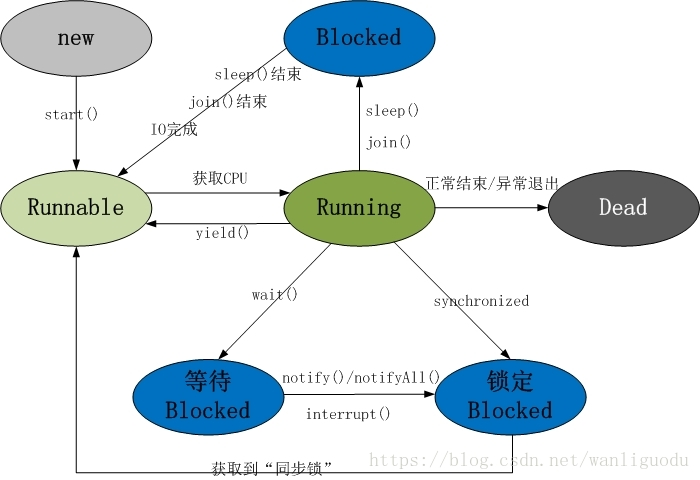
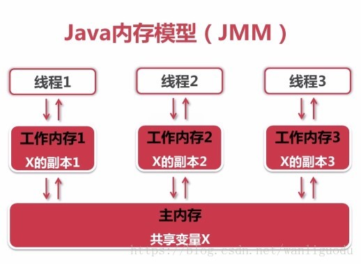

# 一、并行与并发

```
并行：多个CPU实例或是多台机器同时执行一段处理逻辑，是真正的同时。
```

```
并发：通过CPU调度算法，让用户看上去同时执行，实际上从CPU操作层面并不是真正的同时。
并发往往需要公共的资源，对公共资源的处理和线程之间的协调是并发的难点重点。
```

## 1.1 并发与并行比较：

 	 如果你想要一个程序运行的更快，那么可以将其断开为多个片段，在单独的处理器上运行每个片段。并发是用于多处理器编程的基本工具。为了使程序运行得更快，你必须学习如何利用这些额外的处理器，而这正是并发赋予你的能力。
  如果你有一台多处理器的机器，那么就可以在这些处理器之间分部多个任务，从而可以极大的提高吞吐量。这是使用强有力的多处理器Web服务器的常见情况，在为每一个请求分配一个线程的程序中，它可以将大量的用户请求分布到多个CPU上。
  
  **但是，并发通常是提高运行在单处理器上的程序的性能**。
  
  因为，在单处理器上运行的并发程序开销应该比改程序的所有部分都顺序执行的开销大，因为其中增加了所谓的**上下文切换的代价（从一个任务切换到另一个任务）**。表面上看，将程序的所有部分当作单个的任务运行好像是开销更小一点，并且可以节省上下文切换的代价。
  使得这个问题变得有些不同的是**阻塞**。如果程序中的某个任务因为该程序控制范围之外的某些条件（通常是I/O）而导致不能继续执行，那么我们就说这个任务或现场**阻塞**了。如果没有并发，则整个程序都将停止下来，直到外部条件发生变化。但是，如果使用并发来编写程序，那么当一个任务阻塞时，程序中的其他任务还可以继续执行，因此这个程序可以保持继续向前执行。事实上，从性能的角度看，如果没有任务阻塞，那么在单处理器上使用并发就没有任何意义。
  在单处理器系统中的性能提高的常见实例是**事件驱动的编程**。实际上，使用并发最吸引人的一个原因就是要产生具有可响应的用户界面。这也是在Android系统中不允许子线程总访问UI的原因，在Android中的UI控件不是线程安全的，如果在多线程中并发访问可能会导致UI控件处于不可预期的状态。那为什么系统不对UI控件的访问加上锁机制呢？原因有两个：其一，加上锁会让UI访问的逻辑变的复杂；其二，锁机制会降低UI访问的效率，因为锁机制会阻塞某些线程的执行。所以在Android系统中最简单而且高效的方法就是采用单线程模型来处理UI操作。

## 1.2 进程和线程

​	实现并发最直接的方式是在操作系统级别使用**进程**。进程是运行在它**自己的地址空间内**的自包容的程序。

​	多任务操作系统可以通过周期性地将CPU从一个进程切换到另一个进程，来实现同时运行多个（进程）程序，尽管这使得每个进程看起来在其执行过程中都是歇歇停停。进程被操作系统互相隔开，因此不会彼此干涉，这使得用进程编程相对容易一些。

​	与此相反，像Java所使用的这种并发系统会共享诸如内存和I/O这样的资源，因此编程编写多线程程序最基本的困难在于，**协调不同线程驱动的任务之间对这些资源的使用，以便使得这些资源不会同时被多个任务访问**。

# 二、基础概念

## 2.1 线程状态图



### 2.1.1 线程5种状态

1.新建（ New）：线程对象被创建时，它只会短暂的处于这种状态。此时它已经分配了必须的系统资源，并执行了初始化。

例如：Thread  thread = new Thread();

2.就绪（Runnable）：称为"可执行状态"。线程对象被创建后，其他线程调用了该对象的start()方法，从而启动该线程。

例如：thread.start();

处于就绪状态的线程，随时可能被CPU调度执行。

3.运行（Running）：线程获取CPU权限进行执行。

```
注意：
线程只能从就绪状态进入运行状态
```

 4.阻塞（Blocked）：阻塞状态是线程因为某种原因放弃CPU使用权，暂时停止运行。直到线程进入就绪状态，才有机会转到运行状态。

```
阻塞的三种情况：
（1）等待阻塞：通过调用线程的wait()方法，让线程等待某工作的完成。
（2）同步阻塞：线程在获取synchronized同步锁失败（因为锁被其他线程占用），它会进入同步阻塞状态。
（3）其他阻塞：通过调用线程的sleep()或者发出I/O请求时，线程会进入阻塞状态。当sleep()状态超时、join()等待线程终止或超时。或是I/O处理完毕时，线程重新转入就绪状态。
```

5.死亡（Dead）：线程执行完或者因为异常退出run()方法，该线程结束生命周期。

## 2.2 关键字与关键函数

线程的5种状态（新建、就绪、运行、阻塞、死亡）涉及的内容包括Object类，Thread类和synchronized关键字。

```
在Object类中，定义了wait()、notify()、notifyAll()等一系列休眠/唤醒函数。
```

```
在Thread类中，定义了一系列线程操作函数，例如：sleep()休眠函数、interrupt()中断函数、getName()获取线程名称等。
```

```
synchronized关键字：synchronized代码块和synchronized方法。synchronized的作用是让线程获取对象的同步锁。
```

# 三、常用的实现多线程的两种方式

## 3.1 概述

常用的实现多线程的两种方式：Thread和Runnable。之所以说是"常用"，是因为**在java5后可以通过java.until.concurrent包中的线程池来实现多线程**。（[线程进阶.md]( [线程进阶.md](线程进阶.md) )）

Runnable是一个接口，该接口包含了一个**run()**方法，Runnable具有更好的扩展性。

Thread是一个类，**Thread本身是实现了Runnable接口**。

此外，**Runnable还可以用于"资源共享"。即，多个线程都是基于某个Runnable对象创建的，它们会共享Runnable对象上的资源**。

## 3.2 实现多线程实例

### 3.2.1 定义任务（Runnable）

线程可以驱动任务，因此需要一种描述任务的方式。

在Java中用Runnable接口来提供，需要定义任务，只需要实现Runnable接口并编写run()方法，使得该任务可以执行命令。

```java
package com.zjl.javase.thread;

public class RunnableTest {
	public static void main(String[] args) {
		class MyRunnable implements Runnable{
			private int tickets = 10;
			public void run() {
				for (int i = 0; i < 20; i++) {
					if(this.tickets > 0) {
						System.out.println(Thread.currentThread().getName()+ "卖票：	   			tickets"+this.tickets --);
					}
				}
				
			}
			
		}
        // 启动3个线程t1,t2,t3(它们共用一个Runnable对象)，这3个线程一共卖10张票！这说明它们是共享了	MyRunnable接口的。
		MyRunnable runnable = new MyRunnable();
		Thread t1 = new Thread(runnable);
		Thread t2 = new Thread(runnable);
		Thread t3 = new Thread(runnable);
		t1.start();
		t2.start();
		t3.start();
		
	}
}

运行结果：

Thread-1卖票：tickets10
Thread-1卖票：tickets7
Thread-1卖票：tickets6
Thread-1卖票：tickets5
Thread-1卖票：tickets4
Thread-1卖票：tickets3
Thread-1卖票：tickets2
Thread-1卖票：tickets1
Thread-2卖票：tickets9
Thread-0卖票：tickets8

```

### 3.2.2 继承Thread类

将Runnable对象转变为工作任务的传统方式是把它提交给一个Thread构造器。

```java
package com.zjl.javase.thread;

public class ThreadTest {
	public static void main(String[] args) {
		class MyThread extends Thread {
			private int tickets = 10;
			@Override
			public void run() {
				for (int i = 0; i < 20; i++) {
					if(this.tickets > 0){
						System.out.println(this.getName()+"买票：ticket"+this.tickets--);
					}
				}
			}
			
		}
		
		// 启动3个线程t1,t2,t3；每个线程各卖10张票！
        // 和上面的结果对比，并揣摩 “Runnable还可以用于“资源共享”。即，多个线程都是基于某个Runnable对象建立的，它们会共享Runnable对象上的资源”这句话。
		MyThread t1 = new MyThread();
		MyThread t2 = new MyThread();
		MyThread t3 = new MyThread();
		t1.start();
		t2.start();
		t3.start();
	}
}


运行结果：
Thread-0买票：ticket10
Thread-1买票：ticket10
Thread-0买票：ticket9
Thread-0买票：ticket8
Thread-0买票：ticket7
Thread-0买票：ticket6
Thread-2买票：ticket10
Thread-2买票：ticket9
Thread-2买票：ticket8
Thread-2买票：ticket7
Thread-2买票：ticket6
Thread-2买票：ticket5
Thread-2买票：ticket4
Thread-2买票：ticket3
Thread-2买票：ticket2
Thread-2买票：ticket1
Thread-1买票：ticket9
Thread-1买票：ticket8
Thread-1买票：ticket7
Thread-1买票：ticket6
Thread-1买票：ticket5
Thread-1买票：ticket4
Thread-1买票：ticket3
Thread-1买票：ticket2
Thread-1买票：ticket1
Thread-0买票：ticket5
Thread-0买票：ticket4
Thread-0买票：ticket3
Thread-0买票：ticket2
Thread-0买票：ticket1
```

# 四、synchronized 关键字

## 4.1 概述

​	**synchronized关键字是为了解决共享资源竞争的问题**，共享资源一般是**以对象形式存在的内存片段**，但也可以是文件、输入/输出端口，或者是打印机。要控制对共享资源的访问，得先把它包装进一个对象。然后把所有要访问的这个资源的方法标记为synchronized。如果某个任务处于一个对标记为synchronized的方法的调用中，那么在这个线程从该方法返回之前，其他所有要调用类中任何标记为synchronized方法的线程都会被阻塞。所有对象都自动含有**单一的锁（也称为监视器）**。当在对象上调用其任意synchronized方法的时候，对象都被加锁，这时该对象上的其他synchronized方法只有等到前一个方法调用完毕并释放了锁之后才能被调用。 
  **在Java中，每个对象有且仅有一个同步锁**。这也意味着，**同步锁是依赖于对象而存在的**。当我们调用某个对象的synchronized方法时，就获得了该对象的同步锁，不同线程对同步锁的访问是互斥的。因为锁语句产生了一种互相排斥的效果，所以这种机制常常称为**互斥量（mutex）**。


## 4.2 synchronized 基本原则和实例

### 4.2.1 基本原则

synchronized的基本原则总结如下：

**第一条**：当一个线程访问**某个对象**的**synchronized方法**或**synchronized代码块**时，**其他线程**对**该对象**的**该synchronized方法**或**synchronized代码块**的访问将被**阻塞**。

**第二条**：当一个线程访问**某个对象**的**synchronized方法**或**synchronized代码块**时，**其他线程**仍然可以访问**该对象**的**非同步代码块**。

**第三条**：当一个线程访问**某个对象**的**synchronized方法**或**synchronized代码块**时，**其他线程**对**该对象**的**其他的synchronized方法**或**synchronized代码块**的访问将被**阻塞**。

### 4.2.2 实例

**第一条**：当一个线程访问**某个对象**的**synchronized方法**或**synchronized代码块**时，**其他线程**对**该对象**的**该synchronized方法**或**synchronized代码块**的访问将被**阻塞**。

```
package com.zjl.javase.thread;

public class RunnableTest {
	public static void main(String[] args) {
		class MyRunnable implements Runnable{
			private int tickets = 5;
			public void run() {
				synchronized(this){
					for (int i = 0; i < 5; i++) {
							try {
								Thread.sleep(100);
								System.out.println(Thread.currentThread().getName()+" loop " +i);
							} catch (InterruptedException e) {
								e.printStackTrace();
							}
					}
				}
				
			}
			
		}
		
		Runnable runnable = new MyRunnable();
		Thread t1 = new Thread(runnable,"t1");
		Thread t2 = new Thread(runnable,"t2");
		t1.start();
		t2.start();
	}
}

运行结果：
t1 loop 0
t1 loop 1
t1 loop 2
t1 loop 3
t1 loop 4
t2 loop 0
t2 loop 1
t2 loop 2
t2 loop 3
t2 loop 4
```

总结：

**run()**方法中存在**synchronized(this)**代码块，而且t1和t2都是基于**MyRunnable**这个**Runnable对象**创建的线程。这意味着，我们能可以将synchronized(this)中的this看作是**MyRunnable这个Runnable对象**；因此，线程t1和t2共享"MyRunnable对象的同步锁"。所以当一个线程运行时，另外一个线程必须等待**正在运行的线程**释放**MyRunnable的同步锁**之后才能运行。

```java
package com.zjl.javase.thread;

public class ThreadTest {
	public static void main(String[] args) {
		class MyThread extends Thread {
			
			public MyThread(String name) {
				super(name);
			}

			@Override
			public void run() {
				synchronized(this) {
					for (int i = 0; i < 10; i++) {
						try {
							Thread.sleep(100);
							System.out.println(Thread.currentThread().getName() +" loop "+i);
						} catch (InterruptedException e) {
							e.printStackTrace();
						}
					}
				}
			}
			
		}
		
		MyThread t1 = new MyThread("t1");
		MyThread t2 = new MyThread("t2");
		t1.start();
		t2.start();
	}
}

运行结果：
t2 loop 0
t1 loop 0
t2 loop 1
t1 loop 1
t1 loop 2
t2 loop 2
t1 loop 3
t2 loop 3
t1 loop 4
t2 loop 4
t1 loop 5
t2 loop 5
t1 loop 6
t2 loop 6
t1 loop 7
t2 loop 7
t1 loop 8
t2 loop 8
t1 loop 9
t2 loop 9
```

对比：

**实例1**是实现了**Runnable接口**，**实例2**继承了**Thread类**。

在**run()**方法中都有**synchronized(this)**，实例1的结果是先执行线程t1再执行线程t2，实例2的结果是线程t1和t2交替执行。

分析：

**synchronized(this)**是指当前对象，即synchronized(this)所在类对应的对象。它的作用是获取当前对象的同步锁。

对于实例2中的synchronized(this)中的this代表的是Mythread对象，t1和t2是两个不同的Mythread对象。因此t1和t2在执行synchronized(this)时获得的是不同对象的同步锁。

对于实例1来说，synchronized(this)中的this代表的是MyRunnable对象，t1和t2是共同一个MyRunnable对象。

因此，一个线程获取了对象的同步锁，会造成另外一个线程的等待。

**第二条**：当一个线程访问**某个对象**的**synchronized方法**或**synchronized代码块**时，**其他线程**仍然可以访问**该对象**的**非同步代码块**。

```java
package com.zjl.javase.thread;

public class SyncAndNoSync {
	public static void main(String[] args) {
		class Count{
			// 含有synchronized同步块的方法
			public void sync() {
				synchronized(this) {
					for (int i = 0; i < 5; i++) {
						try {
							Thread.sleep(100);
							System.out.println(Thread.currentThread().getName() + " sync loop " +i);
						} catch (InterruptedException e) {
							e.printStackTrace();
						}
					}
					
				}
				
			}
			// 非同步的方法
			public void nosync() {
				for (int i = 0; i < 5; i++) {
					try {
						Thread.sleep(100);
						System.out.println(Thread.currentThread().getName() + " nosync loop " +i);
					} catch (InterruptedException e) {
						e.printStackTrace();
					}
				}
			}
		}
		
		 final Count count = new Count();
	     // 新建t1, t1会调用“count对象”的synMethod()方法
		 Thread t1 = new Thread(new Runnable() {
			
			public void run() {
				
				count.sync();
			}
		},"t1");
		 // 新建t2, t2会调用“count对象”的nonSynMethod()方法
		 Thread t2 = new Thread(new Runnable() {
				
				public void run() {
					count.nosync();
					
				}
			},"t2");
		 
		 t1.start();
		 t2.start();

	}
}

运行结果：
t1 sync loop 0
t2 nosync loop 0
t1 sync loop 1
t2 nosync loop 1
t1 sync loop 2
t2 nosync loop 2
t1 sync loop 3
t2 nosync loop 3
t1 sync loop 4
t2 nosync loop 4
```

结果说明：

线程t1和t2交替执行。t1会调用count对象的sync()方法，该方法中含有同步块；而t2则会调用count对象的nosync()方法，该方法不是同步方法。

t1运行时，虽然调用**synchronized(this)**获取**count对象的同步锁**；但是并没有造成t2阻塞，因为t2没有用到**count对象的同步锁**。

**第三条**：当一个线程访问**某个对象**的**synchronized方法**或**synchronized代码块**时，**其他线程**对**该对象**的**其他的synchronized方法**或**synchronized代码块**的访问将被**阻塞**。

```java
package com.zjl.javase.thread;

public class SyncAndSync {
	public static void main(String[] args) {
		class Count{
			// 含有synchronized同步块的方法
			public void sync() {
				synchronized(this) {
					for (int i = 0; i < 5; i++) {
						try {
							Thread.sleep(100);
							System.out.println(Thread.currentThread().getName() + " sync loop " +i);
						} catch (InterruptedException e) {
							e.printStackTrace();
						}
					}
					
				}
				
			}
            // 也包含synchronized同步块的方法
			public void sync2() {
				synchronized(this) {
					
					for (int i = 0; i < 5; i++) {
						try {
							Thread.sleep(100);
							System.out.println(Thread.currentThread().getName() + " sync2 loop " +i);
						} catch (InterruptedException e) {
							e.printStackTrace();
						}
					}
					
				}
			}
		}
		
		 final Count count = new Count();
	     // 新建t1, t1会调用“count对象”的synMethod()方法
		 Thread t1 = new Thread(new Runnable() {
			
			public void run() {
				
				count.sync();
			}
		},"t1");
		 // 新建t2, t2会调用“count对象”的Syn2Method()方法
		 Thread t2 = new Thread(new Runnable() {
				
				public void run() {
					count.sync2();
					
				}
			},"t2");
		 
		 t1.start();
		 t2.start();

	}
}

运行结果：
t1 sync loop 0
t1 sync loop 1
t1 sync loop 2
t1 sync loop 3
t1 sync loop 4
t2 sync2 loop 0
t2 sync2 loop 1
t2 sync2 loop 2
t2 sync2 loop 3
t2 sync2 loop 4
```

结果说明：

t1和t2运行时都调用synchronized(this)，这个this时Count对象（count），而t1和t2共同count。

因此，在t1运行时，t2会被阻塞，等待t1运行释放"count对象的同步锁"，t2才能运行。

## 4.3 synchronized方法和synchronized代码块

### 4.3.1 概述

​	**synchronized方法**是用synchronized修饰方法，这是一种**粗粒度锁**；这个同步方法（非static）无需显式指定同步监视器，同步方法的同步监视器是**this**，也就是调用该方法的对象。

​	**synchronized代码块**是synchronized修饰代码块，这是一种**细粒度锁**；线程开始执行同步代码块前，必须先获得对同步监视器的锁定，任何时候只能有一个线程可以获得对同步监视器的锁定，当同步代码块执行完成后，该线程会释放对同步监视器的锁定。

​	虽然java允许使用任何对象作为同步监视器，但是同步监视器的目的就是为了阻止两个线程对同一个共享资源进行并发访问，因此通常推荐使用可能被并发访问的共享资源充当同步监视器。

```java
package com.zjl.javase.thread;

public class synchronizedTest {
	public static void main(String[] args) {
		class Demo {
			public synchronized void syncMethod() {
				for (int i = 0; i < 999999999; i++) {
					
				}
			}
			
			public void syncBlock() {
				synchronized(this) {
					for (int i = 0; i < 999999999; i++) {
						
					}
				}
			}
		}
		
		Demo demo = new Demo();
		long start,diff;
		start = System.currentTimeMillis();
		demo.syncMethod();   // 调用“synchronized方法块”
		diff = System.currentTimeMillis() -start; // 获取“时间差值”
		System.out.println(" syncMethod() : "+diff);
		
		start = System.currentTimeMillis();
		demo.syncBlock();  // 调用“synchronized方法块”
		diff = System.currentTimeMillis() -start; // 获取“时间差值”
		System.out.println(" syncBlock() : "+diff);
		
	}
}

运行结果：
 syncMethod() : 3
 syncBlock() : 2
```

结果说明：

**synchronized代码块**可以**更精确**的控制冲突限制访问区域，有时候表现**更高效**。

## 4.4 实例锁和全局锁

### 4.4.1 概念

​	实例锁：锁在某个实例对象上，如果该类是单例，那么该锁也具有全局锁的概念，实例锁对应的就是synchronized关键字。

​	全局锁：该锁针对的是类，无论实例多少个对象，那么线程都共享锁。全局锁对应的就是static synchronized（或是锁在该类上的class或者classloader对象上）。

### 4.4.2 实例

关于**实例锁**和**全局锁**很好的例子：

```java
package com.zjl.javase.thread;

public class Something {
	public synchronized void isSyncA() {
		
	}
	
	public synchronized void isSyncB() {
		
	}
	
	public static  synchronized void cSyncA() {
		
	}
	
	public static synchronized void cSyncB() {
		
	}	
	
}
```

假设，类Something有两个实例（对象）分别为x和y。分析下面4组表达式获取锁的情况。
(1)  x.isSyncA()与x.isSyncB()
(2)  x.isSyncA()与y.isSyncA()
(3)  x.cSyncA()与y.cSyncB()
(4)  x.isSyncA()与Something.cSyncA()

```java
package com.zjl.javase.thread;

public class LockTest {
	static class Something {
		public synchronized void isSyncA() {
			for(int i=0;i<5;i++){
                try {
                    Thread.sleep(100);
                    System.out.println(Thread.currentThread().getName()+" : isSyncA " +i);
                } catch (InterruptedException e) {
                    e.printStackTrace();
                }
            }
		}
		
		public synchronized void isSyncB() {
			for(int i=0;i<5;i++){
                try {
                    Thread.sleep(100);
                    System.out.println(Thread.currentThread().getName()+" : isSyncB " +i);
                } catch (InterruptedException e) {
                    e.printStackTrace();
                }
            }
		}
		
		public static synchronized void cSyncA() {
			for(int i=0;i<5;i++){
                try {
                    Thread.sleep(100);
                    System.out.println(Thread.currentThread().getName()+" : cSyncA " +i);
                } catch (InterruptedException e) {
                    e.printStackTrace();
                }
            }
		}
		
		public static synchronized void cSyncB() {
			for(int i=0;i<5;i++){
                try {
                    Thread.sleep(100);
                    System.out.println(Thread.currentThread().getName()+" : cSyncB " +i);
                } catch (InterruptedException e) {
                    e.printStackTrace();
                }
            }
		}	
		
	}
	
	Something x = new Something();
	Something y = new Something();
	
	private void test1() {
		Thread t11 = new Thread(new Runnable(){
            public void run() {
               // x.isSyncA();    
                x.cSyncA();
            }
        },"t11");

        Thread t12 = new Thread(new Runnable(){
            public void run() {
             //   x.isSyncB();
             //   y.isSyncA();
                y.cSyncB();
                //Something.cSyncA();
            }
        },"t12");

        t11.start();
        t12.start();
	}
	
	public static void main(String[] args) {
		LockTest lockTest1 = new LockTest();
        lockTest1.test1();
	}
	
	
}
```

#### 4.4.2.1 x.isSyncA()与x.isSyncB() 不能同时访问

因为， x.isSyncA()与x.isSyncB()都是访问的同一个对象（对象x）的同步锁。

```java
运行结果：
t11 : isSyncA 0
t11 : isSyncA 1
t11 : isSyncA 2
t11 : isSyncA 3
t11 : isSyncA 4
t12 : isSyncB 0
t12 : isSyncB 1
t12 : isSyncB 2
t12 : isSyncB 3
t12 : isSyncB 4
```

#### 4.4.2.2 x.isSyncA()与y.isSyncA()能同时访问

因为，访问的不是同一个对象的同步锁，x.isSyncA()访问的是x的同步锁，而y.isSyncA()访问的是y的同步锁。
代码只需要在4.4.2.1上的代码将x.isSyncA() 和y.isSyncA()的注释去掉，其他的语句加上注释。

```java
运行结果：
t11 : isSyncA 0
t12 : isSyncA 0
t12 : isSyncA 1
t11 : isSyncA 1
t12 : isSyncA 2
t11 : isSyncA 2
t11 : isSyncA 3
t12 : isSyncA 3
t12 : isSyncA 4
t11 : isSyncA 4
```

#### 4.4.2.3 x.cSyncA()与y.cSyncB() 不能同时被访问

因为cSyncA()和cSyncB()都是**static类型**，x.cSyncA()相当于Something.isSyncA()，y.cSyncB()相当于Something.isSyncB()，因此它们共用一个同步锁，不能被同时反问。
代码只需要在4.4.2.1上的代码将 x.cSyncA()与y.cSyncB() 的注释去掉，其他的语句加上注释。

```java
运行结果：
t11 : cSyncA 0
t11 : cSyncA 1
t11 : cSyncA 2
t11 : cSyncA 3
t11 : cSyncA 4
t12 : cSyncB 0
t12 : cSyncB 1
t12 : cSyncB 2
t12 : cSyncB 3
t12 : cSyncB 4
```

#### 4.4.2.4 x.isSyncA()与Something.cSyncA() 可以被同时访问

因为**isSyncA()是实例方法**，x.isSyncA()使用的是**对象x的锁**；而**cSyncA()是静态方法**，Something.cSyncA()可以理解对使用的是“**类的锁**”。因此，它们是**可以被同时访问**的。
代码只需要在4.4.2.1上的代码将 x.isSyncA()与Something.cSyncA() 的注释去掉，其他的语句加上注释。

```java
运行结果：
t11 : isSyncA 0
t12 : cSyncA 0
t12 : cSyncA 1
t11 : isSyncA 1
t11 : isSyncA 2
t12 : cSyncA 2
t11 : isSyncA 3
t12 : cSyncA 3
t11 : isSyncA 4
t12 : cSyncA 4
```

# 五、volatile 关键字

## 5.1 java 内存模型



​	所有的变量都是存储在主内存中，每个线程都是独立的工作内存，里面保存该线程使用到的变量的副本。线程对共享变量的所有操作必须在自己的工作内存，不同线程之间无法直接访问其他线程工作内存中的变量，线程间变量值传递需要通过主内存来完成。

例如：线程1对共享变量的修改，要想被线程2及时看到，必须经过两个过程：

（1）把工作内存1中更新过的变量刷新到主内存中。

（2）将主内存中最新的共享变量的值更新到线程2中。

## 5.2 基本概念

### 5.2.1 可见性

​	指线程之间的可见性，一个线程该状态对另外一个线程可见。

​	**volatile修饰的变量**就**具有可见性**。volatile修饰的变量**不允许线程内部缓存和重排序**，**即直接修改内存**。但是，volatile修饰的变量**不具有原子性**。

比如：volatile int  a = 0; 之后有一个操作 a++ ; 这个变量a 具有可见性，但是 a++ 依然是一个非原子操作，也就是这个操作同样存在线程安全问题。**在java 中volatile、synchronized和final具有可见性**。

### 5.2.2 原子性

 JVM中执行的最小单位，具有不可分割性。

比如：int a = 0；（a非long和double类型）这个操作是不可分割的，那么我们说这个操作是原子操作。

但是 a++ ;这个实际上就是a = a + 1 ;是可分割的，所以不具有原子操作。非原子操作都会存在线程安全问题,需要我们使用同步技术（synchronized）来让它变成一个原子操作。

一个操作是原子操作，那么我们称它具有原子性。

java的concurrent包下提供了一些原子类，我们可以通过阅读API来了解这些原子类的用法。

比如：AtomticInteger、AtomticLong、AtomticReference等

**在Java中synchronized和在lock、unlock中操作保证原子性。**

### 5.2.3 有序性

​	java语言提供volatile和synchronized两个关键来保证线程之间操作的有序性。

​	volatile是因为其本身有禁止指令重排的。

​	synchronized是由一个变量在同一时刻只允许在一个线程对其操作，也就决定了持有同一个对象锁的两个同步块只能串行执行。

## 5.3 volatile 原理

​	java语言中提供了一种**稍微同步机制，即volatile变量**。用来确保变量的更新操作通知其他线程。当把变量声明为volatile类型后，编译器与运行时都会注意到这个变量是共享的，因此不会将该变量上的操作与其他内存操作仪器重排序。

volatile变量不会被缓存在寄存器或者其他处理器不可见的地方，因此在**读取volatile类型变量时总会返回最新写入的值**。在**访问volatile变量时不会被执行加锁操作**，因此也就**不会重新执行线程阻塞**，**volatile变量是一种比synchronized关键字轻量级的同步机制。**

总的来说，当一个变量被volatile修饰后，**不但具有可见性，而且还禁止指令重排**。volatile的**读性能消耗与普通变量几乎相同**，但是**写操作就慢一些**，因为它**要保证本地代码中插入许多内存屏障指令来保证处理器不发生乱序执行**。

# 六、对线程等待和唤醒的方法

## 6.1 常用方法介绍

在Object类中，定义了wait()、notify()、notifyAll()等接口。

wait()的作用是让当前线程进入等待状态，同时，wait()也会让出当前线程，释放它所持有的锁。

而notify()和notifyAll()的作用，则是唤醒当前对象上的等待线程；

notify()是唤醒单个线程；

而notifyAll()是唤醒所有的线程。

|           API接口            |                           API说明                            |
| :--------------------------: | :----------------------------------------------------------: |
|           notify()           |               唤醒此对象监视器上等待的单个线程               |
|         notifyAll()          |               唤醒此对象监视器上等待的所有线程               |
|            wait()            | 让当前线程处于"等待（阻塞）状态"，直到其他线程调用此对象notify()方法或notifyAll()方法，当前线程被唤醒（进入“就绪状态”） |
|      wait(long timeout)      | 让当前线程处于"等待（阻塞）状态"，直到其他线程调用此对象notify()方法胡总notifyAll()方法或超过指定的时间量，当前线程被唤醒（进入“就绪状态”） |
| wait(long timeout,int nanos) | 让当前线程处于"等待（阻塞）状态"，直到其他线程调用此对象notify()方法或notifyAll()方法或其他某个线程中断当前线程或已超过某个实际时间量，当前线程被唤醒（进入"就绪状态"） |

## 6.2 wait() 和 notify()示例

```java
package com.zjl.javase.thread;

public class waitTest {
	public static void main(String[] args) {
		class ThreadA extends Thread{
			public ThreadA(String name) {
				super(name);
			}

			@Override
			public void run() {
				synchronized(this) {
					System.out.println(Thread.currentThread().getName() +"正在执行");
					
					System.out.println(Thread.currentThread().getName() +"现在要执行 call notify()");
					notify();
				}
			}
			
		}
		
		ThreadA t1 = new ThreadA("t1");
		
		synchronized(t1) {
			//启动线程 t1
			System.out.println(Thread.currentThread().getName() +" start t1");
			t1.start();
			try {
				//主线程等待t1通过notify() 唤醒
				System.out.println(Thread.currentThread().getName()+ "  wait()");
				t1.wait();
			} catch (Exception e) {
				e.printStackTrace();
			}
			
			System.out.println(Thread.currentThread().getName() +"continue");
			
		}
	}
}

运行结果：
main start t1
main  wait()
t1正在执行
t1现在要执行 call notify()
main continue

```

```
结果解释：
（1）主线程通过new ThreadA("t1") 新建线程t1，随后通过synchronized获取t1对象的同步锁；
（2）然后调用t1.start()启动线程t1，主线程执行t1.wait(),释放t1对象的锁，并且进入等待（阻塞）状态，等待t1对象上的线程通过notify()或者notifyAll()将其唤醒；
（3）线程t1运行之后，通过synchronized(this),获取当前对象的锁，接着通过调用notify()唤醒，当前对象上的等待线程，也就是唤醒主线程；
（4）线程t1运行完毕后，释放当前对象的锁，紧接着，主线程获取t1对象的锁，然后接着运行。
```

```
注意：
t1.wait()为什么不是让线程t1等待，而是让主线程main等待？
JDK解释中说，wait()的作用是让当前线程等待，而当前线程指的是正在CPU上运行的线程！
这就意味着，虽然t1.wait()是通过线程t1调用wait()方法，但是调用t1.wait()的地方是在主线程main中。
而主线程必须是当前线程，也就是运行状态，才可以执行t1.wait();
所以当前线程是主线程main。因此，t1.wait()是让主线程等待，而不是线程t1
```

## 6.3 wait(long timeout)和notify()示例

```java
package com.zjl.javase.thread;

public class WaitTimeoutTest {
	public static void main(String[] args) {
		class ThreadA extends Thread {
			public ThreadA(String name) {
				super(name);
			}

			@Override
			public void run() {
				System.out.println(Thread.currentThread().getName() + " run");
				// 死循环
				while (true)
					;
			}
		}

		ThreadA t1 = new ThreadA("t1");
		synchronized (t1) {
			try {
				// 启动“线程t1”
				System.out.println(Thread.currentThread().getName() + " start t1");
				t1.start();

				// 主线程等待t1通过notify()唤醒 或 notifyAll()唤醒，或超过3000ms延时；然后才被唤醒。
				System.out.println(Thread.currentThread().getName() + " call wait ");
				t1.wait(3000);

				System.out.println(Thread.currentThread().getName() + " continue");
			} catch (InterruptedException e) {
				e.printStackTrace();
			}
		}

	}
}

运行结果：
main start t1
main call wait 
t1 run			//大约3秒之后，输出“main continue”
main continue

```

```
流程解释：
（1）主线程通过new ThreadA(“t1”);新建线程1，随后通过synchronized(this)获取“t1对象的同步锁”。
（2）主线程main执行t1.start()启动“线程t1”。
（3）主线程main执行t1.wait(3000)，此时，主线程进入“阻塞状态”。需要“用于t1对象锁的线程通过notify()或者notifyAll()将其唤醒”或者“超过3000ms之后”，主线程main才进入“就绪状态”，然后才可以运行。
（4）线程t1运行之后，进入死循环，会一直不断的运行。
（5）超过3000ms之后，主线程会进入到“就绪状态”，然后接着进入“运行状态”。主线程main和线程t1会一直运行下去。
```

## 6.4 wait()和notifyAll()示例

通过当前的示例，我们知道notify()可以唤醒在此对象监视器上等待的单个线程，notifyAll()的作用是唤醒在此对象监视器上等待的所有线程。

```
package com.zjl.javase.thread;

public class NotifyAllTest {
private static Object obj = new Object();
	
	static class ThreadA extends Thread{
		
		public ThreadA(String name){
			super(name);
		}
		
		@Override
		public void run() {
			
			synchronized(obj){
				
				try {
					System.out.println(Thread.currentThread().getName()+" wait");
					
					obj.wait();
					
					System.out.println(Thread.currentThread().getName() + " continue");
				} catch (InterruptedException e) {
			
					e.printStackTrace();
				}
			}
		}
	}
	/**
	 * @param args
	 */
	public static void main(String[] args) {

		 ThreadA t1 = new ThreadA("t1");
	     ThreadA t2 = new ThreadA("t2");
	     ThreadA t3 = new ThreadA("t3");
	     t1.start();
	     t2.start();
	     t3.start();
	         
	     try {
	    	System.out.println(Thread.currentThread().getName()+" sleep(3000)");
			Thread.sleep(3000);
		} catch (InterruptedException e) {
		
			e.printStackTrace();
		}
		
	     synchronized(obj){
	    	 System.out.println(Thread.currentThread().getName()+ " notifyAll()");
	    	 obj.notifyAll();
	     }
	}
}

运行结果（结果不唯一）：
main sleep(3000)
t1 wait
t2 wait
t3 wait
main notifyAll()
t3 continue
t2 continue
t1 continue
```

```
流程分析：
（1）主线程中新建并启动3个线程t1、t2和t3，并调用start() 方法进入“就绪状态”，然后可能会进入“运行状态”，所以“main sleep(3000)”不一定是第一个输出，可能会是第二个，这要看CPU 时间片执行到那个线程。t1、t2和t3线程那个先执行时，会调用“obj.wait();”阻塞当前线程进入“阻塞状态”，所以t1、t2和t3线程也会依次进入“阻塞状态”，等待其它线程通过notify()或额nofityAll()来唤醒它。
（2）主线程通过sleep(3000)休眠3秒。在主线程休眠3秒的过程中，t1、t2和t3线程应该都运行了。
（3）主线程休眠3秒后，接着运行。执行obj.notifyAll();唤醒obj上等待的线程，即唤醒t1、t2和t3线程。然后，主线程的synchronized（obj）运行完毕，主线程释放“obj对象锁”。这样t1、t2和t3线程就可以获取“obj锁”继续运行。
```

## 6.5 为什么notify()、wait()等函数定义在Object类中而不是Thread类中

​		Object中的wait()、notify()等函数和synchronized一样，会对“对象的同步锁”进行操作。wait()会使“当前线程”等待，因为线程应该释放它所持有的“同步锁”，否则其他线程获取不到该“同步锁”而无法运行。线程调用wait()之后，会释放它所持有的“同步锁”；而且，等待线程可以被notify()或notifyAll()唤醒。那么notify()是依据什么唤醒等待线程的？或者wait()和notify()之间是通过什么关联起来的？答案是：依据**“对象的同步锁”**。
  负责唤醒等待线程的那个线程（我们称为“唤醒线程”），它只有在获取“该对象的同步锁”（**这里的同步锁必须和等待线程的同步锁是同一个**），并且调用notify()或notifyAll()方法之后，才能唤醒等待线程。虽然，等待线程被唤醒，但是，它不能立即执行。因为唤醒线程还持有“该对象的同步锁”。必须等到唤醒线程释放“该对象的同步锁”之后，等待线程才能获取到“对象的同步锁”，然后继续运行。
  总之，**notify()、wait()依赖于“同步锁”，而“同步锁”是该对象所持有，并且每个对象有且仅有一个**。所以，你可以把wait()方法放进任何同步控制方法里，而不用考虑这个类是继承自Thread还是实现了Runnable接口。这就是为什么notify()、wait()等函数定义在Object类，而不是Thread类中的原因。实际上，只能在同步控制方法或同步控制块里调用wait()、notify()和notifyAll()（因为不用操作锁，所以sleep()可以在非同步控制方法里调用）。如果在非同步控制方法里调用这些方法，程序可以通过编译，但运行时将得到IllegalMonitorStateException异常，异常的大概是当前线程不是拥有者。意思是，**调用wait()、notify()和notifyAll()的任务在调用这些方法前必须获取对象的锁**。

# 七、线程让步和休眠

## 7.1 线程让步

​		在Java线程中，**yield()方法的作用是让步**，它能让当前线程由“运行状态”进入到“就绪状态”，从而让其他具有相同优先级的等待线程获取执行权；但是，**并不能保证在当前线程调用yield()之后，其他具有相同优先级的线程就一定能获得执行权；也有可能是当前线程有进入到“运行状态”继续运行**。

```java
package com.zjl.javase.thread;

public class YieldTest {
	public static void main(String[] args) {

		class ThreadA extends Thread{
			public ThreadA(String name){
				super(name);
			}
			
			@Override
			public synchronized void run() {

				for(int i=0;i<10;i++){
					System.out.println(" "+this.getName()+" "+i);
					
					if(i%2 == 0){
						Thread.yield();
					}
				}
			}
		}
		
		ThreadA t1 = new ThreadA("t1");
		ThreadA t2 = new ThreadA("t2");
		t1.start();
		t2.start();

	}

}

运行结果：
 t1 0
 t2 0
 t1 1
 t1 2
 t1 3
 t1 4
 t1 5
 t1 6
 t1 7
 t1 8
 t1 9
 t2 1
 t2 2
 t2 3
 t2 4
 t2 5
 t2 6
 t2 7
 t2 8
 t2 9
```

```
结果说明：
	线程t1在能被2整除的时候，并不一定切换到线程2。这表明，yield()方法虽然可以让线程由“运行状态”进入到“就绪状态”；但是，它不一定会让其他线程获取CPU执行权（其他线程进入到“运行状态”）。即时这个“其他线程”与当前调用yield()的线程具有相同的优先级。
```

## 7.2 yield()和wait()比较

​		wait()的作用是让当前线程由“运行状态”进入到“等待（阻塞）”的同时，也会释放同步锁。而yield()的作用是让步，它也是让当前线程离开“运行状态”。区别是：
（1）wait()是让线程由“运行状态”进入到“等待（阻塞）状态”，而yield()是让线程由“运行状态”进入到“就绪状态”。
（2）wait()是会让线程释放它所持有的对象的同步锁，而yield()方法不会释放对象的同步锁。

```java
package com.zjl.javase.thread;

public class YieldLockTest {
	public static void main(String[] args) {

		final Object obj = new Object();
		
           class ThreadA extends Thread{
  			
			public ThreadA(String name){
				super(name);
			}
			
			@Override
			public void run() {
				synchronized(obj){
					for(int i=0;i<10;i++){
						System.out.println(this.getName()+" "+i);
						if(i%4==0){
							Thread.yield();
						}
					}
				}
			}
		}
	
		ThreadA  t1 = new ThreadA("t1");
		ThreadA  t2 = new ThreadA("t2");
		t1.start();
		t2.start();

	}

}

运行结果：
t1 0
t1 1
t1 2
t1 3
t1 4
t1 5
t1 6
t1 7
t1 8
t1 9
t2 0
t2 1
t2 2
t2 3
t2 4
t2 5
t2 6
t2 7
t2 8
t2 9
```

```
结果说明：
	线程t1和t2在run()会引用同一个对象的同步锁，即synchronized(obj)，在t1运行过程中，虽然它会调用Thread.yield()；但是，t2是没有获取到CPU执行权的，因为，t1并没有释放“obj所持有的同步锁”。
```

## 7.3 线程休眠

​	sleep()方法定义在Thread类中，sleep()的作用是让当前线程休眠，即当前线程会从“运行状态”进入到“休眠（阻塞）状态”。sleep()会指定休眠时间，线程休眠的时间会大于/等于该休眠时间；在线程重新被唤醒时，它会由“阻塞状态”变成“就绪状态”，从而等待CPU的调度执行。（线程只能从就绪状态进入运行状态）

## 7.4 sleep()和wait()的比较

​	wait()的作用是让当前的线程由“运行状态”进入到“等待（阻塞）状态”的同时，也会释放同步锁。但是sleep()的作用是让当前线程由“运行状态”进入到“休眠（阻塞）”状态。**wait()会释放对象的同步锁，而sleep()则不会释放锁**。

```
package com.zjl.javase.thread;

public class RunnableTest2 {
	public static void main(String[] args) {
final Object obj = new Object();
		
		class MyThread extends Thread{
			
			public MyThread(String name){
				super(name);
			}
			@Override
			public void run() {
				synchronized(obj){
					for(int i=0;i<10;i++){
						try {
							 if (i%4 == 0)
								 Thread.sleep(100);
							System.out.println(Thread.currentThread().getName()+" loop "+i);
						} catch (InterruptedException e) {
							// TODO Auto-generated catch block
							e.printStackTrace();
						}
					}
				}
			}
		}
		
		Thread t1 = new MyThread("t1");
		Thread t2 = new MyThread("t2");
		t1.start();
		t2.start();

	}
}

运行结果：
t2 loop 0
t2 loop 1
t2 loop 2
t2 loop 3
t2 loop 4
t2 loop 5
t2 loop 6
t2 loop 7
t2 loop 8
t2 loop 9
t1 loop 0
t1 loop 1
t1 loop 2
t1 loop 3
t1 loop 4
t1 loop 5
t1 loop 6
t1 loop 7
t1 loop 8
t1 loop 9
```

```
结果说明：
	主线程main中启动两个线程t1和t2，t1和t2在run()方法中会引用同一个对象的同步锁，即synchronized(obj)。在t2运行过程中，虽然它会调用Thread.sleep(100)，但是，t1是不会获取CPU执行权的。因为，t1并没有释放“obj所持有的同步锁”。如果，注释掉synchronized(obj)或再次执行该程序，t1和t2是可以相互切换的。
```

# 八、join()方法和interrupt()方法

## 8.1 加入一个线程

​		**一个线程可以在其他线程之上调用join()方法**，其**效果是等待一段时间直到第二个线程结束结束才继续执行**。如果某个线程在另一个线程t上调用t.join()，此线程将被挂起，直到目标线程t结束才恢复（**即t.isAlive()返回为假**）。也可以在调用jion()时带上一个**超时参数**（单位可以是毫秒，或者纳秒），这样如果目标线程在这段时间到期时还没有结束的话，join()方法总能返回。对**join()方法的调用可以被中断，做法是在调用线程上调用interrupt()方法**，这时需要用到**try_catch**子句。

## 8.2 join()源码分析和实例

```java
//无参数的join()方法
public final void join() throws InterruptedException {
        join(0);
}

//两个参数的join()方法
public final synchronized void join(long millis, int nanos)throws InterruptedException {

        if (millis < 0) {
            throw new IllegalArgumentException("timeout value is negative");
        }

        if (nanos < 0 || nanos > 999999) {
            throw new IllegalArgumentException(
                                "nanosecond timeout value out of range");
        }

        if (nanos >= 500000 || (nanos != 0 && millis == 0)) {
            millis++;
        }

        join(millis);
    }
    
//一个参数的join()方法
public final synchronized void join(long millis)throws InterruptedException {
        long base = System.currentTimeMillis();
        long now = 0;

        if (millis < 0) {
            throw new IllegalArgumentException("timeout value is negative");
        }

        if (millis == 0) {
            while (isAlive()) {
                wait(0);
            }
        } else {
            while (isAlive()) {
                long delay = millis - now;
                if (delay <= 0) {
                    break;
                }
                wait(delay);
                now = System.currentTimeMillis() - base;
            }
        }
    }
```

**源码说明：**
		主要是无参数和一个参数的join()方法，从代码中可以发现，当mills == 0 时，会进入while(isAlive())循环，即只要调用该join()方法的线程是活的，那么当前线程就要不停等待。（wait()是让当前线程等待）。

```java
package com.zjl.javase.thread;

public class JoinTest {
	public static void main(String[] args) {


		class ThreadA extends Thread{
			
			public ThreadA(String name){
				super(name);
			}
			
			@Override
			public void run() {
				System.out.println("start "+this.getName());
				
				for(int i=0;i<1000000000;i++)
					;
				
				System.out.println("finish "+ this.getName());
			}
		}

		Thread t1 = new ThreadA("t1");
		t1.start();
		
		try {
			
			t1.join();
			
			System.out.println("finish "+Thread.currentThread().getName());
		} catch (InterruptedException e) {
			e.printStackTrace();
		}
	}

}

运行结果：
start t1
finish t1
finish main
```

```
结果说明：
	在主线程main中新建线程t1，接着，通过t1.start()启动线程t1，并执行t1.join()。然后，主线程会进入“阻塞状态”等待t1运行结束。t1结束之后，会唤醒主线程main，主线程重新获取CPU执行权，继续运行。
```

## 8.3 interrupt() 方法

​		**interrupt()的作用是中断本线程**。**本线程中断自己是被允许的；其他线程调用本线程的interrupt()方法时，会通过checkAccess()检查权限**。这有可能抛出**SecurityException**异常。
  如果本线程是处于阻塞状态：调用线程的wait()，wait(long)或wait(long,int)会让它进入等待（阻塞）状态，或者调用线程的join()，join(long)，join(long,int)，sleep(long)，sleep(long,int)也会让它进入阻塞状态。若**线程在阻塞状态时，调用了它的interrupt()方法，那么它的“中断状态”会被清理并且会收到一个InterruptedException异常**。例如，线程通过wait()进入阻塞状态，此时通过interrupt()中断该线程，调用interrupt()会立即将线程的中断标记设置为“true”，但是由于线程处于阻塞状态，所以该“中断标记”会立即被清除为“false”,同时，会产生一个InterruptedException异常。
  **如果线程被阻塞在一个Selector选择器中，那么通过interrupt()中断它时，线程的中断标记会被设置为true，并且它会立即从选择操作中返回**。
  **如果不属于前面所说的的情况，那么通过interrupt()中断线程时，它的中断标记会被设置为true。中断一个“已经终止的线程”不会产生任何操作**。

## 8.4 线程终止的方式

​		**Thread中的stop()和suspend()方法，由于固有的不安全性，已经不建议使用**。下面，通过讨论线程在“阻塞状态”和“运行状态”的终止方式，然后在总结一个通用的方式

### 8.4.1 终止处于"阻塞状态"的线程

​	通常，我们通过“中断”方式终止处于“阻塞状态”的线程。当线程由于被调用了sleep()，wait()，join()等方法而进入阻塞状态；若此时调用线程的interrupt()将线程的中断标记设为true。由于处于阻塞状态，中断标记会被清除，同时产生InterruptedException异常。将InterruptedException放在适当的为止就能终止线程，形如如下：

```java
@Override
public void run() {
    try {
        while (true) {
            // 执行任务...
        }
    } catch (InterruptedException ie) {  
        // 由于产生InterruptedException异常，退出while(true)循环，线程终止！
    }
}
```

```
说明：
	在while(true)中不断的执行任务，当线程处于阻塞状态时，调用线程的interrupt()产生InterruptedException异常中断。中断的捕获在while(true)之外，这样就退出while(true)循环。
```

```
注意：
	对InterruptedException的捕获一般放在while（true）循环体的外面，这样产生异常时就退出了while（true）循环。否则，InterruptedException在while（true）循环体之内，就需要额外的添加退出处理。形式如下：
```

```java
@Override
public void run() {
    while (true) {
        try {
            // 执行任务...
        } catch (InterruptedException ie) {  
            // InterruptedException在while(true)循环体内。
            // 当线程产生了InterruptedException异常时，while(true)仍能继续运行！需要手动退出
            break;
        }
    }
}
```

```
说明：
	上面的InterruptedException异常捕获在while（true）之内。当产生InterruptedException异常时，被catch处理之外，仍然在while（true）循环体内；要退出while（true）循环体，需要额外的执行退出while（true）的操作。
```

### 8.4.2 终止处于"运行状态"的线程

​	通常，我们通过“标记”方式终止处于“运行状态”的线程。其中包括“中断标记”和“额外添加标记”。

#### 8.4.2.1 通过“中断标记”终止线程

```java
@Override
public void run() {
    while (!isInterrupted()) {
        // 执行任务...
    }
}
```

```
说明：
	isInterrupted()来判断线程中的中断标记是不是为true。当线程处于运行状态，并且我们需要终止它时，可以调用线程的interrupt()方法，使用线程的中断标记为true，即isInterrupted()方法会返回true。此时，就会退出while循环
```

```
注意：
	interrupt()并不会终止处于“运行状态”的线程，它会将线程的中断标记设为true。
```

#### 8.4.2.2 通过"中断标记"终止线程的实例

```java
package com.zjl.javase.thread;

public class InterruptBlock {
	/**
	 * @param args
	 */
	public static void main(String[] args) {


		class MyThread extends Thread{
			
			public MyThread(String name){
				super(name);
			}
			
			@Override
			public void run() {	
				try {
					int i=0;
					while(!isInterrupted()){
					     Thread.sleep(100);
					     i++;
					     System.out.println(Thread.currentThread().getName()+ " ("+this.getState()+") loop "+i);
					}
				} catch (InterruptedException e) {
					e.printStackTrace();
					System.out.println(Thread.currentThread().getName()+ " ("+this.getState()+") catch InterruptedExecption");
				}	
				
			}
		}
		
		
		try {
			
			//新建
			Thread t1 = new MyThread("t1");
			System.out.println(t1.getName()+" ("+t1.getState()+" ) is new.");
			
			System.out.println("luo1:"+t1.isInterrupted());
			//启动
			t1.start();
			System.out.println(t1.getName()+" ("+t1.getState()+" ) is started.");
			System.out.println("luo2:"+t1.isInterrupted());
			//主线程休眠300ms，然后主线程给t1发“中断”指令
			Thread.sleep(300);
			t1.interrupt();
			System.out.println("luo3:"+t1.isInterrupted());
			System.out.println(t1.getName()+" ("+t1.getState()+" ) is interrupted.");
			
			//主线程休眠300ms，然后查看t1的状态
			Thread.sleep(300);
			System.out.println(t1.getName()+" ("+t1.getState()+" ) is interrupted now .");
			
			
		} catch (InterruptedException e) {
			// TODO Auto-generated catch block
			e.printStackTrace();
		}
		
	}

}

运行结果：
t1 (NEW ) is new.
luo1:false
t1 (RUNNABLE ) is started.
luo2:false
t1 (RUNNABLE) loop 1
t1 (RUNNABLE) loop 2
luo3:true
t1 (TIMED_WAITING ) is interrupted.
t1 (RUNNABLE) catch InterruptedExecption
java.lang.InterruptedException: sleep interrupted
	at java.lang.Thread.sleep(Native Method)
	at com.zjl.javase.thread.InterruptBlock$1MyThread.run(InterruptBlock.java:21)
t1 (TERMINATED ) is interrupted now .

```

```
结果说明：
（1）主线程mian新建线程t1，之后通过t1.start()启动线程t1；
（2）t1启动之后，会不断的检查它的中断标记，如果中断标记为“false”，则休眠100ms；
（3）t1休眠之后，会切换到主线程main，主线程再次运行时，会执行t1.interrupt()中端线程t1。t1收到中断指令之后，会将t1的中断标志设置为“false”，而且会抛出IterruptedException异常。在t1的run()方法中，是在循环体while(true)之外获取的异常，因此循环被终止。
如果，将run()方法中捕获InterruptedException异常的代码块移到while循环体内，那么程序会变成一个死循环。解决的办法是，可以在catch中添加break或return就可以解决该问题。
```


#### 8.4.2.3 通过额外添加标记

```java
private volatile boolean flag= true;
protected void stopTask() {
    flag = false;
}

@Override
public void run() {
    while (flag) {
        // 执行任务...
    }
}
```

```
说明：
	线程中有一个flag标记，它的默认值是true；并且我们提供stopTask()来设置flag标记。当我们需要终止该线程时，调用该线程的stopTask()方法就可以让线程退出while循环。
```

```
注意：
	将flag定义为volatile类型，是为了保证flag的可见性。即其它线程通过stopTask()修改了flag之后，本线程能看到修改后的flag的值
```

综合线程处于“阻塞状态”和“运行状态”的终止方式，比较通用的终止线程的形式如下：

```java
@Override
public void run() {
    try {
        // 1. isInterrupted()保证，只要中断标记为true就终止线程。
        while (!isInterrupted()) {
            // 执行任务...
        }
    } catch (InterruptedException ie) {  
        // 2. InterruptedException异常保证，当InterruptedException异常产生时，线程被终止。
    }
}
```

#### 8.4.2.4 通过"额外添加标记"终止线程实例

```
package com.zjl.javase.thread;

public class InterruptBlock2 {
	/**
	 * @param args
	 */
	public static void main(String[] args) {


		class MyThread extends Thread{
			
			public MyThread(String name){
				super(name);
			}
			
			@Override
			public void run() {	
				try {
					int i=0;
					while(!isInterrupted()){
					     Thread.sleep(100);
					     i++;
					     System.out.println(Thread.currentThread().getName()+ " ("+this.getState()+") loop "+i);
					}
				} catch (InterruptedException e) {
					e.printStackTrace();
					System.out.println(Thread.currentThread().getName()+ " ("+this.getState()+") catch InterruptedExecption");
				}	
				
			}
		}
		
		
		try {
			
			//新建
			Thread t1 = new MyThread("t1");
			System.out.println(t1.getName()+" ("+t1.getState()+" ) is new.");
			
			System.out.println("luo1:"+t1.isInterrupted());
			//启动
			t1.start();
			System.out.println(t1.getName()+" ("+t1.getState()+" ) is started.");
			System.out.println("luo2:"+t1.isInterrupted());
			//主线程休眠300ms，然后主线程给t1发“中断”指令
			Thread.sleep(300);
			t1.interrupt();
			System.out.println("luo3:"+t1.isInterrupted());
			System.out.println(t1.getName()+" ("+t1.getState()+" ) is interrupted.");
			
			//主线程休眠300ms，然后查看t1的状态
			Thread.sleep(300);
			System.out.println(t1.getName()+" ("+t1.getState()+" ) is interrupted now .");
			
			
		} catch (InterruptedException e) {
			// TODO Auto-generated catch block
			e.printStackTrace();
		}
		
	}

}

运行结果：
t1 (NEW ) is new.
t1 (RUNNABLE ) is started.
t1 (RUNNABLE) loop 1
t1 (RUNNABLE) loop 2
t1 (TIMED_WAITING ) is interrupted.
t1 (RUNNABLE) loop 3
t1 (TERMINATED ) is interrupted now .
```

## 8.5 interrupt()和isInterrupt()的区别

​	interrupt()和isInterrupted()都能够用于检测对象的“中断标记”。

​	区别是：interrupt()除了返回中断标记之外，它还会清除中断标记（即将中断标记设为false）；而isInterrupted()仅仅返回中断标记。

## 8.6 线程优先级和守护线程

​		Java中线程的优先级的范围是1~10，默认的优先级为5。“高优先级线程”会优先于“低优先级线程”执行。而且Java中有两种线程：用户线程和守护线程。可以通过**isDeamon()**方法来区别它们：**如果返回false，则说明该线程是“用户线程”；否则就是“守护线程”**。**用户线程一般用户执行用户级任务**，而**守护线程也就是“后台线程”，一般用来执行后台任务**。需要注意的是：**JVM在“用户线程”都结束后会退出**。
  每个线程都有一个优先级。**“高优先级线程”会优先于“低优先级线程”执行**。每个线程都可以被标记为一个守护进程或非守护进程。在一些运行的**主线程中创建新的子线程时，子线程的优先级被设置为等于“创建它的主线程的优先级”，当且仅当“创建它的主线程是守护线程”时“子线程才会是守护线程”**。

当**Java虚拟机启动时，通常有一个单一的非守护线程（该线程通过是通过main()方法启动）**。JVM会一直运行直到下面的**任意一个条件发生，JVM就会终止运行**：
(1) 调用了exit()方法，并且exit()有权限被正常执行。
(2) 所有的“非守护线程”都死了(即JVM中仅仅只有“守护线程”)。

