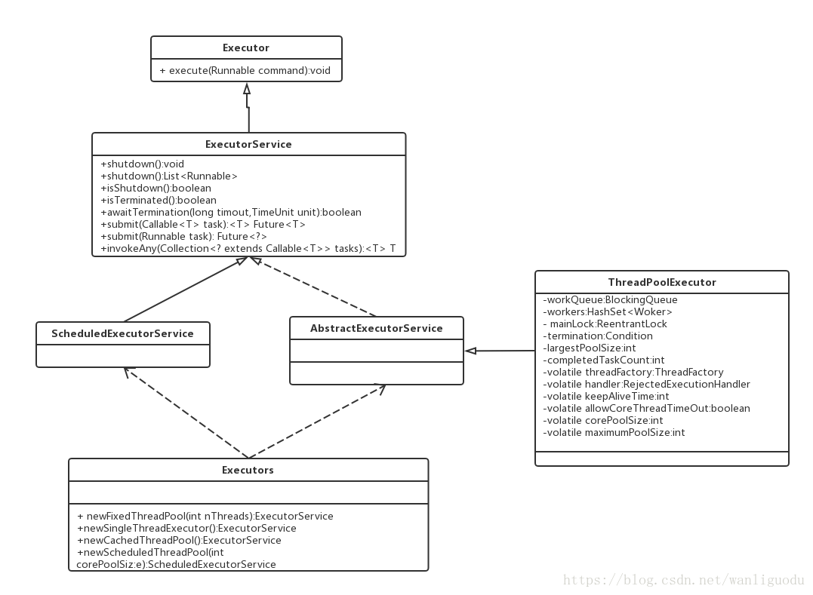
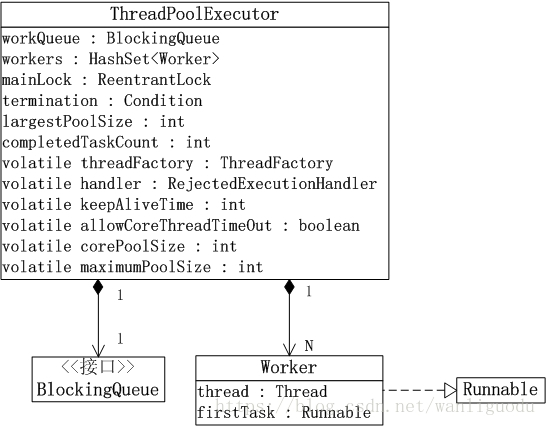
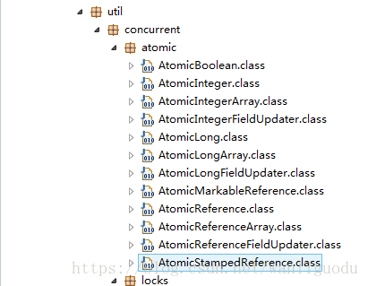

		Java 5 添加了一个新的包到Java平台，这个包是java.util.concurrent包（简称JUC）。这个包包含了有一系列能够让Java的并发编程更加轻松的类。（本文使用的Java 7 版本的JUC）。

# 一、线程池

  线程池的好处，大概可以概括三点：
（1）重用线程池中的线程，避免因为线程的创建和销毁所带来的性能开销。
（2）能有效控制线程池的最大并发数，避免大量线程之间因互相抢夺系统资源而导致的阻塞现象。
（3）能够对线程进行简单的管理，并提供定时执行以及指向间隔循环执行等功能。

## 1.1 线程池的创建

​		Java SE 5的java.util.concurrent包中的执行器（**Executor**）可以管理Thread对象，从而简化了并发编程。Executor**在客户端和任务执行之间提供了一个间接层**；与客户端直接执行任务不同，这个中介对象将执行任务。**Executor允许你管理异步任务的执行，而无须显式的管理线程的生命周期**。Executor在Java中启动任务的优选方法。

```java
package com.zjl.javase.thread;

import java.util.concurrent.ExecutorService;
import java.util.concurrent.Executors;

public class CachedThreadPool {
	/**
     * @param args
     */
    public static void main(String[] args) {

        class MyRunnable implements Runnable{
            private int a = 5;
            public void run() {
                synchronized(this){
                    for(int i=0;i<10;i++){
                        if(this.a>0){
                            System.out.println(Thread.currentThread().getName()+" a的值:"+this.a--);
                        }

                    }
                }
            }

        }
        ExecutorService exec = Executors.newCachedThreadPool();
        for(int i=0;i<5;i++)
            exec.execute(new MyRunnable());
        exec.shutdown();

    }
}

运行结果：
pool-1-thread-1 a的值:5
pool-1-thread-1 a的值:4
pool-1-thread-1 a的值:3
pool-1-thread-1 a的值:2
pool-1-thread-1 a的值:1
pool-1-thread-2 a的值:5
pool-1-thread-2 a的值:4
pool-1-thread-2 a的值:3
pool-1-thread-2 a的值:2
pool-1-thread-2 a的值:1
pool-1-thread-3 a的值:5
pool-1-thread-3 a的值:4
pool-1-thread-3 a的值:3
pool-1-thread-3 a的值:2
pool-1-thread-3 a的值:1
pool-1-thread-4 a的值:5
pool-1-thread-5 a的值:5
pool-1-thread-4 a的值:4
pool-1-thread-5 a的值:4
pool-1-thread-4 a的值:3
pool-1-thread-5 a的值:3
pool-1-thread-5 a的值:2
pool-1-thread-4 a的值:2
pool-1-thread-5 a的值:1
pool-1-thread-4 a的值:1
```

```
说明：
这个结果可以和Java多线程基础定义任务（Runnable）的例子和结果做对比。发现用Executor来管理时，Runnable中的“资源不在共享”，这个疑问我还没有解决？知道的可以告诉我一声。(其实是共享的，见如下代码)
```

```java
package com.zjl.javase.thread;

import java.util.concurrent.ExecutorService;
import java.util.concurrent.Executors;

public class CachedThreadPool2 {
	/**
     * @param args
     */
    public static void main(String[] args) {

        class MyRunnable implements Runnable{
            private int a = 5;
            public void run() {
                synchronized(this){
                    for(int i=0;i<10;i++){
                        if(this.a>0){
                            System.out.println(Thread.currentThread().getName()+" a的值:"+this.a--);
                        }

                    }
                }
            }

        }
        ExecutorService exec = Executors.newCachedThreadPool();
        MyRunnable run1 = new MyRunnable();
        for(int i=0;i<5;i++)
            exec.execute(run1);
        exec.shutdown();

    }
}
运行结果：
pool-1-thread-1 a的值:5
pool-1-thread-1 a的值:4
pool-1-thread-1 a的值:3
pool-1-thread-1 a的值:2
pool-1-thread-1 a的值:1
```

**ExecutorService是一个接口，并继承了接口Executor。而Executors是一个工具类**，下面来看看它们之间的UML图：



其中**最为主要的是ThreadPoolExecutor类和Executors中的四类方法**。

### 1.1.1 ThreadPoolExecutor

#### 1.1.1.1 ThreadPoolExecutor简介

​		**ThreadPoolExecutor是线程池类**。对于线程池，可以通俗的将它理解为“**存放一定数量的一个线程集合**。线程池允许若个线程同时运行，运行**同时运行的线程数量就是线程池的容量**。**当添加到线程池中的线程超过它的容量时，会有一部分线程阻塞等待，线程池会通过相应的调度策略和拒绝策略，对添加到线程池中的线程进行管理**。”

#### 1.1.1.2 ThreadPoolExecutor的数据结构



ThreadPoolExecutor类中比较典型的部分代码：

```java
public class ThreadPoolExecutor extends AbstractExecutorService {
    // 阻塞队列。
    private final BlockingQueue<Runnable> workQueue;
    // 互斥锁
    private final ReentrantLock mainLock = new ReentrantLock();
    // 线程集合。一个Worker对应一个线程。
    private final HashSet<Worker> workers = new HashSet<Worker>();
    // “终止条件”，与“mainLock”绑定。
    private final Condition termination = mainLock.newCondition();
    // 线程池中线程数量曾经达到过的最大值。
    private int largestPoolSize;
    // 已完成任务数量
    private long completedTaskCount;
    // ThreadFactory对象，用于创建线程。
    private volatile ThreadFactory threadFactory;
    // 拒绝策略的处理句柄。
    private volatile RejectedExecutionHandler handler;
    // 保持线程存活时间。
    private volatile long keepAliveTime;

    private volatile boolean allowCoreThreadTimeOut;
    // 核心池大小
    private volatile int corePoolSize;
    // 最大池大小
    private volatile int maximumPoolSize;

    //构造方法
   public ThreadPoolExecutor(int corePoolSize,
                              int maximumPoolSize,
                              long keepAliveTime,
                              TimeUnit unit,
                              BlockingQueue<Runnable> workQueue,
                              ThreadFactory threadFactory,
                              RejectedExecutionHandler handler) {
        if (corePoolSize < 0 ||
            maximumPoolSize <= 0 ||
            maximumPoolSize < corePoolSize ||
            keepAliveTime < 0)
            throw new IllegalArgumentException();
        if (workQueue == null || threadFactory == null || handler == null)
            throw new NullPointerException();
        this.corePoolSize = corePoolSize;
        this.maximumPoolSize = maximumPoolSize;
        this.workQueue = workQueue;
        this.keepAliveTime = unit.toNanos(keepAliveTime);
        this.threadFactory = threadFactory;
        this.handler = handler;
    }
}
```

对一些关键的变量进行介绍：

##### 1.1.1.2.1 workers

​		workers是**HashSet类型**，它是**一个Worker集合**。而一个Worker对应一个线程，也就是说线程池通过workers包含了“一个线程集合”。**当Worker对应的线程池启动时，它会执行线程池中的任务；当执行完一个任务后，它会从线程池的阻塞队列中取出一个阻塞的任务来继续运行**。workers的作用是：**线程池通过它来实现了“允许多个线程同时运行**”。

##### 1.1.1.2.2 workQueue

​		workQueue是**BlockingQueue类型**，它是**一个阻塞队列**。当**线程池中的线程超过它的容量的时候，线程会进入阻塞队列进行阻塞等待**。workQueue的作用是：**让线程池实现了阻塞功能**。

#####  1.1.1.2.3 mainLock

​		mainLock是**互斥锁**，通过mainLock**实现了对线程池的互斥访问**。

##### 1.1.1.2.4 corePoolSize 和 maximumPoolSize

​	corePoolSize是“**核心池大小**”，maximumPoolSize是“**最大池大小**”。它们的作用是：**调整“线程池中实际运行的线程的数量**”。
例如，当新任务提交给线程池时（通过execute方法）。
​	(1) 如果此时，线程池中运行的线程数量 小于 corePoolSize；则仅当阻塞队列满时才创建新线程。

​	(2) 如果此时，线程池中运行的线程数量 大于 corePoolSize，但却是 小于 maximumPoolSize；则仅当阻塞队列满时才	创建新线程。

​	(3) 如果此时，corePoolSize和maximumPoolSize相同，则创建了固定大小的线程池。如果maximumPoolSize设置为基	本的无界值（如，Integer.MAX_VALUE），则允许线程池适应任意数量的并发任务。在大多数情况下，核心池大小和最	大池大小的值在创建线程池设置的。但是，也可以使用setCorePoolSize（int）和setMaximumPoolSize（int）进行动态	更改。

##### 1.1.1.2.5 poolSize

​	poolSize是**当前线程池的实际大小，即线程池中任务的数量**。

##### 1.1.1.2.6 allowCoreThreadTimeOut 和 keepAliveTime

​	allowCoreThreadTimeOut表示**是否允许“线程在空闲状态时，仍然能够存活”**。
​	keepAliveTime表示**线程池处于空闲状态的时候，超过keepAliveTime时间之后，空闲的线程会被终止**。

##### 1.1.1.2.7 threadFactory 

​	threadFactory是**ThreadFactory对象**，它是**一个线程工厂类**，即“**线程池通ThreadFactory创建线程**”

##### 1.1.1.2.8 handler

​	handler是**RejectedExecutionHandler类型**。它是“**线程池拒绝策略**”的句柄，也就是说“**当某任务添加到线程池中，而线程池拒绝任务是，线程池会通过handler进行相应的处理**”

​		综上所述，**线程池通过workers来管理“线程集合”，每个线程在启动后，会执行线程池中的任务；当一个任务执行完后，它会从线程池的阻塞队列中取出任务来继续运行。阻塞队列时管理线程池任务的队列，当添加到线程池中的任务超过线程池的容量时，该任务就会进入阻塞队列进行等候**。

### 1.1.2 线程池的分类

​		**ExecutorService是Executor直接的扩展接口**，也是最常用的线程池接口，我们通常见到的线程池定时任务线程池都是它的实现类。上面的**Executors.newCachedThreadPool()**;Executors还有其他静态方法可以调用，每个方法都有不同特性，它们都是**直接或间接的通过配置ThreadPoolExecutor来实现自己的功能特性**，这**四类线程池**分别是**FixedThreadPool**、**CachedThreadPool**、**ScheduledThreadPool**以及**SingleThreadExecutor**。

#### 1.1.2.1 FixedThreadPool

​		**通过调用Executors的newFixedThreadPool方法来创建**。它是一种**线程数量固定的线程池**，**当线程池处于空闲状态时，它们并不会被回收，除非线程池被关闭了**。**当所有的线程都处于活动状态时，新任务都会处于等待状态，直到有线程空闲出来**。由于FixedThreadPool**只有核心线程线程并且这些核心线程不会被回收**，这意味着它**能够更加快速的响应外界的请求**。newFixedThreadPool方法的实现如下，可以发现**FixedThreadPool中只有核心线程并且这些核心线程没有超时机制，另外任务队列也是没有大小限制的**。

```java
public static ExecutorService newFixedThreadPool(int nThreads) {
    return new ThreadPoolExecutor(nThreads, nThreads,
                                  0L, TimeUnit.MILLISECONDS,
                                  new LinkedBlockingQueue<Runnable>());
}
```

​		newFixedThreadPool()在调用ThreadPoolExecutor()时，它传递一个LinkedBlockingQueue()对象，而**LinkedBlockingQueue是单向链表实现的阻塞队列**。在线程池中，就是通过该阻塞队列来实现“当线程池中任务数量超过允许的任务数量时，部分任务会阻塞等待”。
  有了FixedThreadPool，你可以一次性预先执行代价高昂的线程分配，因而也就可以限制线程的数量了。这可以节省时间，因为你不用为每个任务都固定的付出创建线程的开销。在事件驱动的系统中，这种方式较好。

#### 1.1.2.2 SingleThreadExecutor

​	**通过Executors的newSingleThreadExecutor方法来创建**。这类线程池内部**只有一个核心线程**，它**确保所有的任务都在同一个线程中按顺序执行**。SingleThreadExecutor的意义在于**统一所有的外界任务到一个线程中**，这使得这些任务之间**不需要处理线程同步的问题**。SingleThreadExecutor方法的实现如下所示：

```java
public static ExecutorService newSingleThreadExecutor() {
        return new FinalizableDelegatedExecutorService
            (new ThreadPoolExecutor(1, 1,
                                    0L, TimeUnit.MILLISECONDS,
                                    new LinkedBlockingQueue<Runnable>()));
 }
```

​	这对于希望在另一个线程中连续运行的任何事物（长期存活的任务）来说，这是很有用的，例如监听进入的套接字连接的任务。它对于希望在线程中运行的短任务也是同样方便，例如，更新本地或远程日志的小任务，或者是事件分发线程。

#### 1.1.2.3 ScheduledThreadPool

​	**通过Executors的newScheduledPool方法来创建**。**它的核心线程数量时固定的，而非核心线程数是没有限制的，并且当非核心线程闲置是会被立即回收**。ScheduledThreadPool这类线程主要**用于执行定时任务和具有固定周期的重复任务**，newScheduledThreadPool方法的实现如下：

```java
public static ScheduledExecutorService newScheduledThreadPool(int corePoolSize) {
        return new ScheduledThreadPoolExecutor(corePoolSize);
}

public static ScheduledExecutorService newScheduledThreadPool(
            int corePoolSize, ThreadFactory threadFactory) {
        return new ScheduledThreadPoolExecutor(corePoolSize, threadFactory);
}
```

ScheduledThreadPoolExecutor继承ThreadPoolExecutor，并实现ScheduledExecutorService。

#### 1.1.2.4 CachedThreadPool

​	**通过Executors的newCachedThreadPool方法来创建**。它是**一种线程数量不定的线程池，它只有非核心线程，并且其最大线程数为Integer.MAX_VALUE**。由于Integer.MAX_VALUE是一个很大的数，实际上就相当于最大线程数可以任意大。**当线程池中的线程都是处于活动状态时，线程池会创建新的线程来处理新任务，否则就会利用空闲的线程来处理新任务**。**线程池中的空闲线程都有超时机制**，**这个超时长为60秒，超过60秒闲置线程就会被回收**。**和FixedThreadPool不同的是，CachedThreadPool的任务队列其实相当于一个空集合**，这将导致**任何任务都会立即被执行**，因为在这种场景下SynchronousQueue是无法插入任务的。SynchronousQueue是一个非常特殊的队列，在很多情况下可以把它简单理解为一个无法存储元素的队列，由于它在实际中较少使用，这里就不探讨了。从CachedThreadPool的特性来看，这类线程池比较**适合执行大量的耗时较少的任务**。当**整个线程池都处于闲置状态时，线程池中的线程都会超时而被终止**，这个时候**CachedThreadPool之中实际上是没有任何线程的，它几乎是不占用任何系统资源的**，newCachedThreadPool的实现方法如下：

```java
 public static ExecutorService newCachedThreadPool() {
        return new ThreadPoolExecutor(0, Integer.MAX_VALUE,
                                      60L, TimeUnit.SECONDS,
                                      new SynchronousQueue<Runnable>());
}
```

## 1.2 线程池中任务的添加

### 1.2.1 execute()

execute()定义在ThreadPoolExecutor.java中，源码如下：

```java
public void execute(Runnable command) {
    // 如果任务为null，则抛出异常。
    if (command == null)
        throw new NullPointerException();
    // 获取ctl对应的int值。该int值保存了"线程池中任务的数量"和"线程池状态"信息
    int c = ctl.get();
    // 当线程池中的任务数量 < "核心池大小"时，即线程池中少于corePoolSize个任务。
    // 则通过addWorker(command, true)新建一个线程，并将任务(command)添加到该线程中；然后，启动该线程从而执行任务。
    if (workerCountOf(c) < corePoolSize) {
        if (addWorker(command, true))
            return;
        c = ctl.get();
    }
    // 当线程池中的任务数量 >= "核心池大小"时，
    // 而且，"线程池处于允许状态"时，则尝试将任务添加到阻塞队列中。
    if (isRunning(c) && workQueue.offer(command)) {
        // 再次确认“线程池状态”，若线程池异常终止了，则删除任务；然后通过reject()执行相应的拒绝策略的内容。
        int recheck = ctl.get();
        if (! isRunning(recheck) && remove(command))
            reject(command);
        // 否则，如果"线程池中任务数量"为0，则通过addWorker(null, false)尝试新建一个线程，新建线程对应的任务为null。
        else if (workerCountOf(recheck) == 0)
            addWorker(null, false);
    }
    // 通过addWorker(command, false)新建一个线程，并将任务(command)添加到该线程中；然后，启动该线程从而执行任务。
    // 如果addWorker(command, false)执行失败，则通过reject()执行相应的拒绝策略的内容。
    else if (!addWorker(command, false))
        reject(command);
}
```

```
说明：
execute()的作用是将任务添加到线程池中执行。它分为三种情况：
（1）如果“线程池中任务数量” < “核心池大小” 时，即线程池中少于corePoolSize个任务；此时就新建一个线程，并将该任务添加到线程中进行执行。
（2）如果“线程池中任务数量” >= “核心池大小” ，并且“线程池是允许状态”；此时，则将任务添加到阻塞队列中阻塞等待。在该情况下，会再次确认“线程状态”，如果“第2次读到的线程池状态”和“第1次读到的线程次状态”不同，则从阻塞队列中删除该任务。
（3）如果非上述的两种情况，就会尝试新建一个线程，并将该任务添加到线程中进行执行。如果执行失败，则通过reject()拒绝该任务。
```

### 1.2.2 addWorker()

addWorker()的源码如下：

```java
private boolean addWorker(Runnable firstTask, boolean core) {
    retry:
    // 更新"线程池状态和计数"标记，即更新ctl。
    for (;;) {
        // 获取ctl对应的int值。该int值保存了"线程池中任务的数量"和"线程池状态"信息
        int c = ctl.get();
        // 获取线程池状态。
        int rs = runStateOf(c);

        // 有效性检查
        if (rs >= SHUTDOWN &&
            ! (rs == SHUTDOWN &&
               firstTask == null &&
               ! workQueue.isEmpty()))
            return false;

        for (;;) {
            // 获取线程池中任务的数量。
            int wc = workerCountOf(c);
            // 如果"线程池中任务的数量"超过限制，则返回false。
            if (wc >= CAPACITY ||
                wc >= (core ? corePoolSize : maximumPoolSize))
                return false;
            // 通过CAS函数将c的值+1。操作失败的话，则退出循环。
            if (compareAndIncrementWorkerCount(c))
                break retry;
            c = ctl.get();  // Re-read ctl
            // 检查"线程池状态"，如果与之前的状态不同，则从retry重新开始。
            if (runStateOf(c) != rs)
                continue retry;
            // else CAS failed due to workerCount change; retry inner loop
        }
    }

    boolean workerStarted = false;
    boolean workerAdded = false;
    Worker w = null;
    // 添加任务到线程池，并启动任务所在的线程。
    try {
        final ReentrantLock mainLock = this.mainLock;
        // 新建Worker，并且指定firstTask为Worker的第一个任务。
        w = new Worker(firstTask);
        // 获取Worker对应的线程。
        final Thread t = w.thread;
        if (t != null) {
            // 获取锁
            mainLock.lock();
            try {
                int c = ctl.get();
                int rs = runStateOf(c);

                // 再次确认"线程池状态"
                if (rs < SHUTDOWN ||
                    (rs == SHUTDOWN && firstTask == null)) {
                    if (t.isAlive()) // precheck that t is startable
                        throw new IllegalThreadStateException();
                    // 将Worker对象(w)添加到"线程池的Worker集合(workers)"中
                    workers.add(w);
                    // 更新largestPoolSize
                    int s = workers.size();
                    if (s > largestPoolSize)
                        largestPoolSize = s;
                    workerAdded = true;
                }
            } finally {
                // 释放锁
                mainLock.unlock();
            }
            // 如果"成功将任务添加到线程池"中，则启动任务所在的线程。 
            if (workerAdded) {
                t.start();
                workerStarted = true;
            }
        }
    } finally {
        if (! workerStarted)
            addWorkerFailed(w);
    }
    // 返回任务是否启动。
    return workerStarted;
}
```

​	addWorker()的作用是**将firstTask添加到线程池中，并启动该任务**。当core为true是，则以corePoolSize为界限，若“线程池中已有任务数量” >= corePoolSize ，那么返回false；当core为false时，则以maximumPoolSize为界限，若“线程池中已有任务数量” >= maximumPoolSize ,则返回false。addWorker()方法会先通过for循环不断尝试更新 ctl状态，**ctl 记录了“线程池中任务数量和线程池状态”**。更新成功后，在通过try模块来将任务添加到线程池中，并启动任务所在的线程。
​	从addWorker()方法中，我们可以发现：**线程池在添加任务时，会创建任务对应的Worker对象，而一个Worker对象包含了一个Thread对象。通过将Worker对象添加到“线程的workers集合中”，从而实现将任务添加到线程池中**。**通过启动Worker对应的Thread线程，则执行该任务。**

	### 1.2.3 submit()

submit()实际上也是通过调用execute()实现的，源码如下：

```java
public Future<?> submit(Runnable task) {
    if (task == null) throw new NullPointerException();
    RunnableFuture<Void> ftask = newTaskFor(task, null);
    execute(ftask);
    return ftask;
}
```

## 1.3 线程池的关闭

在ThreadPoolExecutor类中的shutdown()方法源码为：

```java
public void shutdown() {
    final ReentrantLock mainLock = this.mainLock;
    // 获取锁
    mainLock.lock();
    try {
        // 检查终止线程池的“线程”是否有权限。
        checkShutdownAccess();
        // 设置线程池的状态为关闭状态。
        advanceRunState(SHUTDOWN);
        // 中断线程池中空闲的线程。
        interruptIdleWorkers();
        // 钩子函数，在ThreadPoolExecutor中没有任何动作。
        onShutdown(); // hook for ScheduledThreadPoolExecutor
    } finally {
        // 释放锁
        mainLock.unlock();
    }
    // 尝试终止线程池
    tryTerminate();
}
```

## 1.4 使用Callable

​	**Runnable是执行工作的独立任务，但是它不返回任何值**。如果你希望**任务在完成时能够返回一个值，那么可以实现Callable接口而不是Runnable接口**。在Java SE 5 中引入的**Callable是一种具有类型参数的泛型**，**它的类型参数表示的是从方法call()中返回的值，并且必须使用ExecutorService.submit()方法调用它**，下面是简单示例：

```
1. snychronized和lock的区别？ 为什么要将同步的synchronized换成现实lock,现实lock的好处都是什么？
	代码层：用lock可以显示的加锁和解锁。
	性能：在并发高的时候lock有优势，相反synchronized有优势。
	所有对象都自动还有单一的锁。JVM负责跟踪对象被加锁的次数。如果以个对象被解锁，其计数器变为0，在线程第一次给对象加锁的时候计数器变为1.每当这个相同线程在此对象上获得锁时计数器会递增。只有首先获得锁的线程才能继续获得该对象上的多个锁。每当任务离开时计数器递减减。当计数器为0的时候锁被完全释放。synchronized作用于方法时锁住的是this作用于静态方法时锁住的是Class，作用于一般对象时锁住的是代码块 这就是对象监视器。
	lock原理不同synchornized面向对象 它基于栈中的框架而不是某个具体对象，所以lock只需要在栈里设置锁的开始和结束的地方就行了不用关心框架大小对象的变化。这么做的好处是lock提供无条件的，可轮询的，定时的可中断的锁获取操作。相对于synchronized来说 synchronized的锁的获取是释放必须在一个模块里，获取和释放的顺序必须相反而lock则可以再不同范围内获取释放，并且顺序无关。
	综合看来高并发的时候还是用lock  历史遗留问题所以synchronized还未淘汰。
```

```java
package com.zjl.javase.thread;

import java.util.ArrayList;
import java.util.concurrent.Callable;
import java.util.concurrent.ExecutionException;
import java.util.concurrent.ExecutorService;
import java.util.concurrent.Executors;
import java.util.concurrent.Future;

public class CallableDemo {
	/**
     * @param args
     */
    public static void main(String[] args) {


        class TaskWithResult implements Callable<String>{

            private int id;
            public TaskWithResult(int id){
                this.id = id;
            }
            public String call() throws Exception {

                return "result of Callable "+id;
            }

        }

        ExecutorService exec = Executors.newCachedThreadPool();
        ArrayList<Future<String>>  results = new ArrayList<Future<String>>();
        for(int i=0;i<5;i++){
            results.add(exec.submit(new TaskWithResult(i)));
        }

        for(Future<String> fs:results){
            try {
                System.out.println(fs.get());
            } catch (InterruptedException e) {
                // TODO Auto-generated catch block
                e.printStackTrace();
            } catch (ExecutionException e) {
                // TODO Auto-generated catch block
                e.printStackTrace();
            }finally{
                exec.shutdown();
            }
        }
    }
}

运行结果：
result of Callable 0
result of Callable 1
result of Callable 2
result of Callable 3
result of Callable 4
```

submit()方法会产生Future对象，它用Callable返回结果的特定类型进行了参数化。

# 二、解决共享资源竞争

​	在Java SE5 的java.util.concurrent类库中还包含有定义在**java.util.concurrent.locks中的显式的互斥机制**。**Lcok对象必须被显示的创建、锁定、和释放**。因此，它**与内间的锁形式相比，代码缺乏优雅性**。但是，**对于解决某些类型的问题，它更加灵活**。下面是用Lock写以解决共享资源的示例：

```java
package com.zjl.javase.thread;

import java.util.concurrent.locks.Lock;
import java.util.concurrent.locks.ReentrantLock;

public class LockAndUnLock {
	static Lock lock = new ReentrantLock();//新建锁

    public static void main(String[] args) {

        new Thread("A"){
            public void run() {
                Thread.yield();//当前线程的让步，加快线程切换
                numPrint();

            };
        }.start();

        new Thread("B"){
            public void run() {
                Thread.yield();//当前线程的让步，加快线程切换
                numPrint();
            };
        }.start();

    }

    private static void numPrint(){
        lock.lock();
        try{
            for(int i=0;i<10;i++){
                Thread.sleep(100);
                System.out.println("当前线程"+Thread.currentThread().getName()+"："+i);
            }
        }catch(Exception e){

        }finally{
            lock.unlock();
        }
    }
}

运行结果：
当前线程A：0
当前线程A：1
当前线程A：2
当前线程A：3
当前线程A：4
当前线程A：5
当前线程A：6
当前线程A：7
当前线程A：8
当前线程A：9
当前线程B：0
当前线程B：1
当前线程B：2
当前线程B：3
当前线程B：4
当前线程B：5
当前线程B：6
当前线程B：7
当前线程B：8
当前线程B：9
```

​		可以看出一个被互斥调用的锁，并使用**lock()和unlock()**方法在numPrint()内**创建了临界资源**。当你在使用Lock对象时，将这里的所示的惯用法内部化是很重要的：**紧接着的对lock()的调用，你必须放再finally子句中带有unlock()的try-finally语句中**。尽管try-finally所需的代码比synchronized关键字要多，但是这也代表了显示的Lock对象的优点之一。如果在**使用synchronized关键字，某些事务失败了，那么就会抛出一个异常。但是你没有机会去做任何清理工作，以维护系统使其处于良好状态**。有了**显示的Lock对象，你就可以使用finally子句将系统维护在正确的状态了**。
  大体上，当你使用synchronized关键字时，需要写的代码量更少，并且用户错误出现的可能性也会降低，因此**通常只有在解决特殊问题时，才使用显示的Lock对象**。

# 三、JUC的原子类

​	在Java SE5 中java.util.concurrent.atomic包下提供了一系列支持无锁线程安全修改操作的基础变量。这些原子类是对volatile机制的扩展，并提供下面形式的原子性条件更新操作：

```java
boolean compareAndSet(expectedValue, updateValue);
```

每个Atomic类基本都有这个方法，compareAndSet通过原子实现CAS操作，最底层基本基于汇编语言实现。 
CAS是compareAndSet的一个简称： 
（1）以知当前内存里面的值current和预期要传的值（expectedValue）进行比较（==） 
（2）**如果比价（==）相等，返回true，更新值为updateValue**；**如果不相等，返回false，值不改变**。




Atomic包下的原子类有哪些？上面是JDK 1.7.0_17中源码的截图：

在atomic包下有12个类，这些类大致可以划分为四种类型： 

（1）基本原子类：AtomicInteger，AtomicLong，AtomicBoolean这3个基本类型的原子类 
（2）数组原子类：AtomicIntegerArray，AtomicLongArray，AtomicReferenceArray这3个原子类 
（3）引用原子类：AtomicReference，AtomicStampedRerence,，AtomicMarkableReference这3个原子类 
（4）对象属性修改原子类：AtomicIntegerFiledUpdater，AtomicLongFieldUpdater，AtomicReferenceFieldUpdater这3个原子类 

## 3.1 基本原子类

### 3.1.1 AtomicBoolean

```java
package com.zjl.javase.thread;

import java.util.concurrent.atomic.AtomicBoolean;

public class atomticTest {
	/**
     * @param args
     */
    public static void main(String[] args) {

        AtomicBoolean atomicBoolean = new AtomicBoolean();

        System.out.println("atomicBoolean默认值为:"+atomicBoolean.get());

        atomicBoolean.set(true);
        System.out.println("atomicBoolean set设置值为："+atomicBoolean.get());

        //以原子方式设置为给定值，并返回以前的值
        Boolean oldValue = atomicBoolean.getAndSet(true);
        System.out.println("getAndSet返回以前的值为："+oldValue);
        System.out.println("atomicBoolean现在的值为："+atomicBoolean.get());

        boolean expectedValue = false;
        boolean newValue = true;

        boolean value = atomicBoolean.compareAndSet(expectedValue, newValue);
        System.out.println("compareAndSet后返回的值："+value);
        System.out.println("atomicBoolean现在的值为："+atomicBoolean.get());
    }

}
运行结果：
atomicBoolean默认值为:false
atomicBoolean set设置值为：true
getAndSet返回以前的值为：true
atomicBoolean现在的值为：true
compareAndSet后返回的值：false
atomicBoolean现在的值为：true
```

compareAndSet()方法简单说明介绍： 
	compareAndSet()方法允许你对AtomicBoolean的当前值与一个期望值进行比较，**如果当前值等于期望值的话，将会对AtomicBoolean设置一个新值（即，第二个参数）**。**如果不等于期望值的，AtomicBoolean将返回期望的值（即，第一个参数）,AtomicBoolean的值还是原来的值**。

注意：

AtomicBoolean的返回值和AtomicBoolean得到的值。

### 3.1.2 AtomicInteger 和 AtomicLong

AtomicLong和AtomicInteger的用法基本一致，只是数据的基本类型不一样，下面以AtomicInteger为例，来说明用法： 

```java
package com.zjl.javase.thread;

import java.util.concurrent.atomic.AtomicInteger;

public class AtomicIntegerTest {
	/**
     * @param args
     */
    public static void main(String[] args) {

        AtomicInteger integer = new AtomicInteger(123);
        System.out.println(integer);
        // 以原子方式设置当前值时
        integer.set(147);

        int expect = 147;
        int update = 300;
        // 如果当前值 == expect，则以原子方式将该值设置为update。成功返回true，否则返回false，并且不修改原值。
        integer.compareAndSet(expect, update);
        System.out.println(integer);

        //以原子方式将当前值加1，并返回加1前的值。等价于“num++”
        System.out.println("getAndIncrement的值："+integer.getAndIncrement());
        //以原子方式将当前值加1，并返回加1后的值。等价于“++num”
        System.out.println("incrementAndGet的值："+integer.incrementAndGet());
        //以原子方式将当前值减1，并返回减1前的值。等价于“num--”
        System.out.println("getAndDecrement的值为："+integer.getAndDecrement());
        //以原子方式将当前值减1，并返回减1后的值。等价于“--num”
        System.out.println("decrementAndGet的值为："+integer.decrementAndGet());
        //以原子方式将当前值加10，并返回加10后的值
        System.out.println("addAndGet的值为："+integer.addAndGet(10));
        //以原子方式将当前值加10，并返回加10前的值
        System.out.println("getAndAdd的值为："+integer.getAndAdd(10));
    }

}

运行结果：
123
300
getAndIncrement的值：300
incrementAndGet的值：302
getAndDecrement的值为：302
decrementAndGet的值为：300
addAndGet的值为：310
getAndAdd的值为：310    
```

## 3.2 引用原子类

### 3.2.1 AtomicReference

​	AtomicReference提供了一个可以被原子性读和写的**对象**引用变量。原子性的意思是多个想要改变同一个AtomicReference的线程不会导致AtomicReference处于不一致的状态。 
AtomicReference函数列表：

```java
// 使用 null 初始值创建新的 AtomicReference。
AtomicReference()
// 使用给定的初始值创建新的 AtomicReference。
AtomicReference(V initialValue)

// 如果当前值 == 预期值，则以原子方式将该值设置为给定的更新值。
boolean compareAndSet(V expect, V update)
// 获取当前值。
V get()
// 以原子方式设置为给定值，并返回旧值。
V getAndSet(V newValue)
// 最终设置为给定值。
void lazySet(V newValue)
// 设置为给定值。
void set(V newValue)
// 返回当前值的字符串表示形式。
String toString()
// 如果当前值 == 预期值，则以原子方式将该值设置为给定的更新值。
boolean weakCompareAndSet(V expect, V update)
```

```java
package com.zjl.javase.thread;

import java.util.concurrent.atomic.AtomicReference;

public class AtomicReferenceTest {
	public static void main(String[] args) {


        Student stu1 = new Student(123);
        Student stu2 = new Student(456);
        Student stu3 = new Student(789);

        AtomicReference reference = new AtomicReference(stu1);

        reference.compareAndSet(stu2, stu3);

        System.out.println(((Student) reference.get()).getAge());

        //创建泛型AtomicReference
        AtomicReference<String> refer = new AtomicReference("atmoicReference about generic");
        String str = refer.get();
        System.out.println(str);

    }
}

class Student{
	private int age;

	public int getAge() {
		return age;
	}

	public void setAge(int age) {
		this.age = age;
	}

	public Student(int age) {
		super();
		this.age = age;
	}
	
}

运行结果：
123
atmoicReference about generic
```

AtomicReference说明： 
（1）通过将value设置为volatile类型。这保证了线程修改value的值时，其他线程看到的value值都是最新的value值，即修改之后的volatile的值。 
（2）通过CAS设置value。这保证了：当某线程通过CAS函数（compareAndSet函数）设置value时，它的操作是原子的，即线程在操作value时不会别中断。

### 3.2.2 AtomicStampedReference 和 AtomicMarkableReference

​		前面介绍了AtomicInteger和Atomiclong的操作，但是在这两个类在CAS操作的时候会遇到ABA问题：简单来将就是多线程环境下，2次读写中一个线程修改A->B，然后又B->A，另一个线程看到的值未改变，又继续修改成自己的期望值。当然如果我们不关心过程，只关心结果，那么这个就是无所谓的ABA问题。为了解决ABA问题，Java为我们提供了AtomicStampedReference和AtomicMarkableReference类，两者的区别是：AtomicStampedReference侧重你改变了几次值，AtomicMarkableReference侧重你是否改变了值。

```java
package com.zjl.javase.thread;

import java.util.concurrent.atomic.AtomicMarkableReference;
import java.util.concurrent.atomic.AtomicStampedReference;

public class AtomicStampedReferenceTest {
	/**
     * @param args
     */
    public static void main(String[] args) {


        final AtomicStampedReference<Integer> stampedReference = new AtomicStampedReference(10,0);
        final int stamp = stampedReference.getStamp();
        final int reference = stampedReference.getReference();

        final AtomicMarkableReference<Integer> markableReference = new AtomicMarkableReference(10,true);
        final int getmarkAbleReference = markableReference.getReference();
        final boolean mark = markableReference.isMarked();

        System.out.println("stamp的值为："+stamp+"\n"+"reference的值为："+reference);
        System.out.println("mark的值为："+stamp+"\n"+"getmarkAbleReference的值为："+reference);

        Thread t1 = new Thread(new Runnable(){

            public void run() {
                boolean isUpdateSuccess = stampedReference.compareAndSet(reference, reference+10, stamp, stamp+1);
                System.out.println(Thread.currentThread().getName()+" isUpdateSuccess:"+isUpdateSuccess);

                boolean isMarkable = markableReference.compareAndSet(getmarkAbleReference, getmarkAbleReference+10, mark, false);
                System.out.println(Thread.currentThread().getName()+" isMarkable:"+isMarkable);
            }

        });

        Thread t2 = new Thread(new Runnable(){

            public void run() {
                boolean isUpdateSuccess = stampedReference.compareAndSet(reference, reference+10, stamp, stamp+1);
                System.out.println(Thread.currentThread().getName()+" isUpdateSuccess:"+isUpdateSuccess);

                boolean isMarkable = markableReference.compareAndSet(getmarkAbleReference, getmarkAbleReference+10, mark, false);
                System.out.println(Thread.currentThread().getName()+" isMarkable:"+isMarkable);
            }

        });

        try {
            t1.start();
            t1.join();
            t2.start();
            t2.join();
        } catch (InterruptedException e) {
            // TODO Auto-generated catch block
            e.printStackTrace();
        }

        System.out.println("stamp的值为："+stampedReference.getStamp()+"\n"+"reference的值为："+stampedReference.getReference());
        System.out.println("mark的值为："+ markableReference.isMarked()+"\n"+"getmarkAbleReference的值为："+markableReference.getReference());

    }

}

运行结果：
stamp的值为：0
reference的值为：10
mark的值为：0
getmarkAbleReference的值为：10
Thread-0 isUpdateSuccess:true
Thread-0 isMarkable:true
Thread-1 isUpdateSuccess:false
Thread-1 isMarkable:false
stamp的值为：1
reference的值为：20
mark的值为：false
getmarkAbleReference的值为：20
```

结果说明：

​		可以看到在线程t2更新stampedReference的值时失败了，因为版本号改变了或是标记（mark）改变了，所以AtomicStampedReference和AtomicMarkableReference可以帮我们解决CAS操作中的ABA问题。
注意:	

​		AtomicMarkableReference它并不能解决ABA的问题 ，它是通过一个boolean来标记是否更改，本质就是只有true和false两种版本来回切换，只能降低ABA问题发生的几率，并不能阻止ABA问题的发生。

## 3.3 数组原子类

​	除了提供基本数据类型外，JDK还为我们准备了数组等复合结构。当前可用的原子数组有：**AtomicIntegerArray、AtomicLongArray和AtomicReferenceArray**，分别表示整数数组、long型数组和普通对象数组。

### 3.3.1 AtomicIntegerArray

​	列举AtomicIntegerArray的几个核心API

```JAVA
AtomicIntegerArray本质上是对int[]类型的封装。使用Unsafe类通过CAS的方式控制int[]在多线程下的安全性。它提供了以下几个核心API：
//获得数组第i个下标的元素
public final int get(int i)
//获得数组的长度
public final int length()
//将数组第i个下标设置为newValue，并返回旧的值
public final int getAndSet(int i, int newValue)
//进行CAS操作，如果第i个下标的元素等于expect，则设置为update，设置成功返回true
public final boolean compareAndSet(int i, int expect, int update)
//将第i个下标的元素加1
public final int getAndIncrement(int i)
//将第i个下标的元素减1
public final int getAndDecrement(int i)
//将第i个下标的元素增加delta（delta可以是负数）
public final int getAndAdd(int i, int delta)
```

```java
package com.zjl.javase.thread;

import java.util.concurrent.atomic.AtomicIntegerArray;

public class AtomicIntegerArrayTest {
	static AtomicIntegerArray integerArray = new AtomicIntegerArray(10);

    public static class AddThread implements Runnable{

        int j = 0;

        public void run() {
            for(int i=0;i<10000;i++){
                integerArray.getAndIncrement(i%integerArray.length());
            }

        }

    }

    public static void main(String[] args) {

        Thread[] ts = new Thread[10];
        for(int i=0;i<10;i++){
            ts[i] = new Thread(new AddThread());
        }

        for(int i=0;i<10;i++){
            ts[i].start();
        }
        for(int i=0;i<10;i++){
            try {
                ts[i].join();
            } catch (InterruptedException e) {
                // TODO Auto-generated catch block
                e.printStackTrace();
            }
        }

        System.out.println(integerArray);
    }

}
运行结果：
[10000, 10000, 10000, 10000, 10000, 10000, 10000, 10000, 10000, 10000]
```

	说明：
		首先，新建了10个AtomicIntegerArray类型的数组，然后在Runable内对数组内10个元素进行累加操作，每个元素各加1000次，然后再开启10个线程。因此，可以预测，如果线程安全，数组内10个元素的值必然都是10000；反之，如果线程不安全，则部分或者全部数值会小于10000。
### 3.3.2 AtomicLongArray 和 AtomicReferenceArray

​	AtomicLongArray和AtomicReferenceArray的用法和AtomicIntegerArray 的用法都是大同小异，具体的方法在这里就不一一介绍了，用法同AtomicIntegerArray

## 3.4 对象属性修改原子类

​	基本原子类和数组原子类在最初设计编码时候就已经考虑到了需要保证原子性。但是往往有很多情况就是，由于需求的更改，原子性需要在后面加入，类似于我**不要求你这整个类操作具有原子性，只要求类里面一个字段操作具有原子性**。所以，**AtomicIntegerFiledUpdater、AtomicLongFieldUpdater和AtomicReferenceFieldUpdater**就是这个作用。

### 3.4.1 AtomicLongFiledUpdater

**AtomicIntegerFiledUpdater就是用来更新某一个实例对象里面的int属性的**，但是需要注意的是，用法上有如下规则：
（1）**字段必须是volatile类型的**，在线程之间共享变量时保证立即可见。
（2）**字段的描述类型（修饰符public/protected/default/private）是与调用者与操作对象字段的关系一致**。也就是说**调用者能过直接操作对象字段，那么就可以反射进行原子操作**。
（3）**对于父类的字段，子类时不能直接操作的**，尽管子类可以访问父类的字段。
（4）**只能是实例变量，不能是类变量，也就是说不能加static关键字**
（5）**只能是可修改变量，不能使final变量，因为final的语义就是不可修改的**
（6）**对于AtomicIntegerFiledUpdater和AtomicLongFiledUpdater只能修改int/long类型的字段，不能修改其包装类型（Integer/Long）**。如果要**修改包装类型就需要使用AtomicReferenceFiledUpdater**。

AtomicLongFieldUpdater的主要函数列表：

```java
// 受保护的无操作构造方法，供子类使用。
protected AtomicLongFieldUpdater()

// 以原子方式将给定值添加到此更新器管理的给定对象的字段的当前值。
long addAndGet(T obj, long delta)
// 如果当前值 == 预期值，则以原子方式将此更新器所管理的给定对象的字段设置为给定的更新值。
abstract boolean compareAndSet(T obj, long expect, long update)
// 以原子方式将此更新器管理的给定对象字段当前值减 1。
long decrementAndGet(T obj)
// 获取此更新器管理的在给定对象的字段中保持的当前值。
abstract long get(T obj)
// 以原子方式将给定值添加到此更新器管理的给定对象的字段的当前值。
long getAndAdd(T obj, long delta)
// 以原子方式将此更新器管理的给定对象字段当前值减 1。
long getAndDecrement(T obj)
// 以原子方式将此更新器管理的给定对象字段的当前值加 1。
long getAndIncrement(T obj)
// 将此更新器管理的给定对象的字段以原子方式设置为给定值，并返回旧值。
long getAndSet(T obj, long newValue)
// 以原子方式将此更新器管理的给定对象字段当前值加 1。
long incrementAndGet(T obj)
// 最后将此更新器管理的给定对象的字段设置为给定更新值。
abstract void lazySet(T obj, long newValue)
// 为对象创建并返回一个具有给定字段的更新器。
static <U> AtomicLongFieldUpdater<U> newUpdater(Class<U> tclass, String fieldName)
// 将此更新器管理的给定对象的字段设置为给定更新值。
abstract void set(T obj, long newValue)
// 如果当前值 == 预期值，则以原子方式将此更新器所管理的给定对象的字段设置为给定的更新值。
abstract boolean weakCompareAndSet(T obj, long expect, long update)
```

```java
package com.zjl.javase.thread;

import java.util.concurrent.atomic.AtomicLongFieldUpdater;

public class AtomicLongFiledUpdaterTest {
	/**
     * @param args
     */
    public static void main(String[] args) {


        //获取student的class对象
        Class cls = Student2.class;
         // 新建AtomicLongFieldUpdater对象，传递参数是“class对象”和“long类型在类中对应的名称”
        AtomicLongFieldUpdater atoLong = AtomicLongFieldUpdater.newUpdater(cls, "age");
        Student2 stu = new Student2(123456L);

        atoLong.compareAndSet(stu, 123456L, 1000);
        System.out.println("age= "+stu.age);

    }
}

class Student2{
	volatile long age;

	public long getAge() {
		return age;
	}

	public void setAge(long age) {
		this.age = age;
	}

	public Student2(long age) {
		super();
		this.age = age;
	}
	
}
运行结果：
age= 1000
```

**AtomicIntegerFieldUpdater是一个抽象类，但是它内部有一个private final类型的默认子类，所以在调用newUpdater的时候，会用模式子类来实现**：

```java
 public static <U> AtomicLongFieldUpdater<U> newUpdater(Class<U> tclass, String fieldName) {
        if (AtomicLong.VM_SUPPORTS_LONG_CAS)
            return new CASUpdater<U>(tclass, fieldName);
        else
            return new LockedUpdater<U>(tclass, fieldName);
}

```

​	newUpdater()的作用是**获取一个AtomicIntegerFieldUpdater类型的对象。它实际返回的是CASUpdater对象，或者LockedUpdater对象**；具体返回哪一个类取决于JVM是否支持long类型的CAS函数。CASUpdater和LockedUpdater都是AtomicIntegerFieldUpdater的子类，它们的实现类似。下面以CASUpdater来进行说明。

CASUpdater类的源码如下：

```java
 private static class CASUpdater<T> extends AtomicLongFieldUpdater<T> {
        private static final Unsafe unsafe = Unsafe.getUnsafe();
        private final long offset;
        private final Class<T> tclass;
        private final Class<?> cclass;

        CASUpdater(final Class<T> tclass, final String fieldName,
                   final Class<?> caller) {
            final Field field;
            final int modifiers;
            try {
                field = AccessController.doPrivileged(
                    new PrivilegedExceptionAction<Field>() {
                        public Field run() throws NoSuchFieldException {
                            return tclass.getDeclaredField(fieldName);
                        }
                    });
                modifiers = field.getModifiers();
                sun.reflect.misc.ReflectUtil.ensureMemberAccess(
                    caller, tclass, null, modifiers);
                ClassLoader cl = tclass.getClassLoader();
                ClassLoader ccl = caller.getClassLoader();
                if ((ccl != null) && (ccl != cl) &&
                    ((cl == null) || !isAncestor(cl, ccl))) {
                  sun.reflect.misc.ReflectUtil.checkPackageAccess(tclass);
                }
            } catch (PrivilegedActionException pae) {
                throw new RuntimeException(pae.getException());
            } catch (Exception ex) {
                throw new RuntimeException(ex);
            }

            Class<?> fieldt = field.getType();
            if (fieldt != long.class)
                throw new IllegalArgumentException("Must be long type");

            if (!Modifier.isVolatile(modifiers))
                throw new IllegalArgumentException("Must be volatile type");

            this.cclass = (Modifier.isProtected(modifiers) &&
                           caller != tclass) ? caller : null;
            this.tclass = tclass;
            offset = unsafe.objectFieldOffset(field);
        }
```

```java
public boolean compareAndSet(T obj, long expect, long update) {
    if (obj == null || obj.getClass() != tclass || cclass != null) fullCheck(obj);
    return unsafe.compareAndSwapLong(obj, offset, expect, update);
}
```

它实际上是通过CAS函数操作。如果类的long对象的值是expect，则设置它的值为update。

### 3.4.2 AtomicIntegerFiledUpdater 和 AtomicReferenceFiledUpdater

**AtomicIntegerFiledUpdater 和AtomicReferenceFieldUpdater实现思想基本一致**