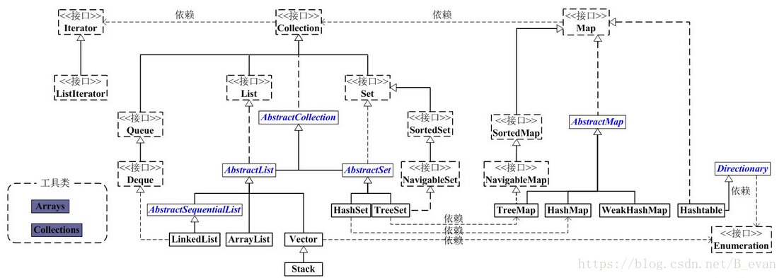
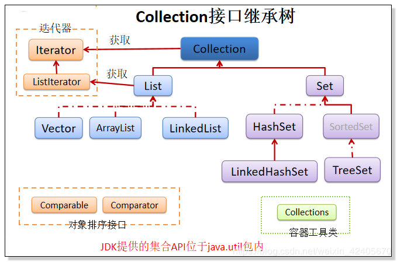
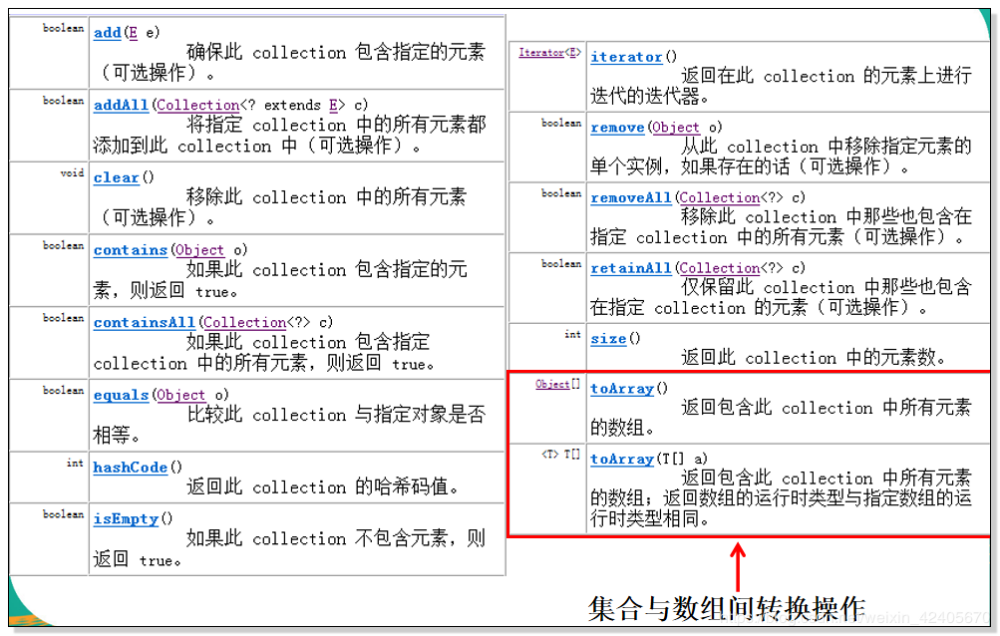

# 一、什么是集合

# 1.1 集合的由来

​	通常，Java程序需要根据程序运行时才知道创建了多少个对象。但若非程序运行，程序开发阶段，我们根本不知道到底需要多少个数量的对象，甚至不知道它的准确类型。为了满足这些常规的编程需要，我们要求能在任何时候，任何地点创建任意数量的对象，而这些对象用什么来容纳呢？我们首先想到了数组，但是数组只能存放同一类型的数据，而且其长度是固定的，那怎么办了？集合便应运而生了。

### 1.1.1 集合与数组比较

内存中对数据进行存储和管理的容器：集合、数组

#### 1.1.1.1 数组存储的特点和缺点?

##### 1.1.1.1.1 特点

(1)数组一旦创建成功，长度不可变

(2)元素存储的类型就是数组声明时的类型。

##### 1.1.1.1.2 缺点

(1) 数组的长度不可变

(2)数组的API属性比较少，比如没有 增，删，改，插 等

(3)存储的元素是有序的可重复的，对无序的不可重复的无能为力。

#### 1.1.1.2 集合存储的优点

(1) 长度可变

(2) 底层的数据结构比较丰富，存储方式不一样决定了该集合的性能效率不一样。比如：数组，链表，红黑树

(3) 集合的API比较丰富，比如 增，删，改，查，插等

(4) 集合存储可以是引用类型,如果是基本类型可以是包装类类型，集合对数据的存储方式支持也比较多，比如有序可重复，无序不可重复。

(5) 部分集合是线程安全的,部分集合是线程不安全 (synchronized)

(6) 集合框架被设计成一个接口,不同的集合的实现不一样,那么效率不一样,
特点不一样,我们可以自由选取。

## 1.2 java集合框架





### 1.2.1 集合框架特点

从上述所有的集合类可以发现如下特点:

1.集合主要**分为Collection和Map两个接口**。

2.**Collection又分别被List、Set、Queue 继承**。该接口里定义的方法既可用于操作 Set 集合，也可用于操作 List 和 		Queue 集合。

3.**List被AbstractList实现**，然后分为3个子类，**ArrayList，LinkList和Vector**。

4.**Set被AbstractSet实现**，又分为2个子类，**HashSet和TreeSet**。

5.**Map被AbstractMap实现**，又分为2个子类，**HashMap和TreeMap**。

6.**Map被Hashtable实现**。

7.**除了map系列的集合，其他集合都实现了Iterator接口**。

```
Iterator是一个用来遍历集合中元素的接口，主要有hashNext()，next()，remove()三种方法。它的子接口ListIterator在它的基础上又添加了三种方法，分别是add()，previous()，hasPrevious()。
```

8.JDK不提供Collection接口的任何直接实现，而是提供更具体的子接口(如：Set和List)实现。

9.此外，在 Java5 之前，Java 集合会丢失容器中所有对象的数据类型，把所有对象都当成 Object 类型处理；从 JDK 5.0 增加了**泛型**以后，Java 集合可以记住容器中对象的数据类型。　　

### 1.2.2 Collection接口常用方法



#### 1.2.2.1 增加功能

boolean add(E e)
boolean addAll(Collection<? extends E> c)

#### 1.2.2.2 删除功能

void clear()
boolean remove(Object o)
boolean removeAll(Collection<?> c)

#### 1.2.2.3 修改功能

Iterator iterator()
Object[] toArray()

#### 1.2.2.4 查询功能

Iterator iterator()
Object[] toArray()
T[] toArray(T[] a)

```
Object[] toArray()、T[] toArray(T[] a)用于集合与数组间转换
```

#### 1.2.2.5 获取功能

int size()

#### 1.2.2.6 判断功能

boolean contains(Object o)
boolean containsAll(Collection<?> c)
boolean isEmpty()

#### 1.2.2.7 其他功能

boolean retainAll(Collection<?> c)

```
boolean retainAll(Collection<?> c) 返回原集合是否发生改变，改变了返回true，没改变返回false。
```

```java
package com.zjl.javase.collection;

import java.util.ArrayList;
import java.util.Collection;

public class CollectionDemo {
	public static void main(String[] args) {
		Collection c = new ArrayList();
		c.add("张三");
		c.add("李四");
		c.add("王五");
		c.add("赵六");
		System.out.println(c); // [张三, 李四, 王五, 赵六]
		
		// boolean addAll(Collection c)
		Collection c2 = new ArrayList(); 
		c2.add("曹操");
		c2.add("萨达姆");
		c2.add("本拉登");
		c.addAll(c2);
		
		System.out.println(c);
		
		// boolean remove(Object o) 
		System.out.println("remove: " + c.remove("张三"));
		System.out.println(c);
		// boolean removeAll(Collection<?> c) 
//		System.out.println("removeAll: " + c.removeAll(c2));
//		System.out.println(c);
		
		// void clear() 
//		c.clear();
//		System.out.println(c);
		
		System.out.println(c.size());
		
		System.out.println("contains: " + c.contains("李四"));
		System.out.println("contains: " + c.contains("曹操"));
		System.out.println("contains: " + c.contains(""));
		System.out.println("containsAll: " + c.containsAll(c2));
		System.out.println("isEmpty: " + c.isEmpty());
		
		Collection c3 = new ArrayList();
//		c3.add("张三");
//		c3.add("李四");
//		c3.add("王五");
//		c3.add("赵六");
//		c3.add("曹操");
//		c3.add("萨达姆");
//		c3.add("本拉登");
//		c3.add("秦始皇");
		System.out.println(c);
		System.out.println(c3);
		System.out.println("retainAll:" + c.retainAll(c3));
		System.out.println("c:" + c);
		
	}

}
运行结果：
[张三, 李四, 王五, 赵六]
[张三, 李四, 王五, 赵六, 曹操, 萨达姆, 本拉登]
remove: true
[李四, 王五, 赵六, 曹操, 萨达姆, 本拉登]
6
contains: true
contains: true
contains: false
containsAll: true
isEmpty: false
[李四, 王五, 赵六, 曹操, 萨达姆, 本拉登]
[]
retainAll:true
c:[]
```


