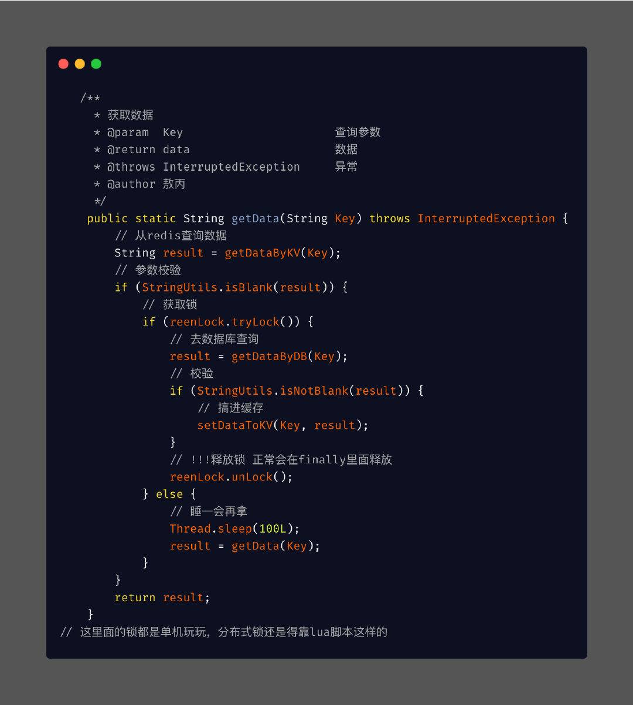

# 1. Redis缓存雪崩

## 1.1 例子

​	如果所有首页的Key失效时间都是12小时，中午12点刷新的，我零点有个秒杀活动大量用户涌入，假设当时每秒 6000 个请求，本来缓存在可以扛住每秒 5000 个请求，但是缓存当时所有的Key都失效了。此时 1 秒 6000 个请求全部落数据库，数据库必然扛不住，它会报一下警，真实情况可能DBA都没反应过来就直接挂了。此时，如果没用什么特别的方案来处理这个故障，DBA 很着急，重启数据库，但是数据库立马又被新的流量给打死了。这就是我理解的缓存雪崩

## 1.2 解决办法

​	处理缓存雪崩简单，**在批量往`Redis`存数据的时候，把每个Key的失效时间都加个随机值**就好了，这样可以保证数据不会在同一时间大面积失效，我相信，Redis这点流量还是顶得住的。

```java
setRedis（Key，value，time + Math.random() * 10000）；
```

​	如果Redis是集群部署，将热点数据均匀分布在不同的Redis库中也能避免全部失效的问题，不过本渣我在生产环境中操作集群的时候，单个服务都是对应的单个Redis分片，是为了方便数据的管理，但是也同样有了可能会失效这样的弊端，失效时间随机是个好策略。或者设置热点数据永远不过期，有更新操作就更新缓存就好了（比如运维更新了首页商品，那你刷下缓存就完事了，不要设置过期时间），电商首页的数据也可以用这个操作，保险。

# 2. 缓存穿透

## 2.1 例子

​	缓存穿透是指缓存和数据库中都没有的数据，而用户不断发起请求，我们数据库的 id 都是1开始自增上去的，如发起为id值为 -1 的数据或 id 为特别大不存在的数据。这时的用户很可能是攻击者，攻击会导致数据库压力过大，严重会击垮数据库。

​	像这种你如果不对参数做校验，数据库id都是大于0的，我一直用小于0的参数去请求你，每次都能绕开Redis直接打到数据库，数据库也查不到，每次都这样，并发高点就容易崩掉了。

## 2.2 解决方法

​	**缓存穿透我会在接口层增加校验**，比如用户鉴权校验，参数做校验，不合法的参数直接代码Return，比如：id 做基础校验，id <=0的直接拦截等。

​	Redis还有一个高级用法**布隆过滤器（Bloom Filter）**这个也能很好的防止缓存穿透的发生，他的原理也很简单就是**利用高效的数据结构和算法快速判断出你这个Key是否在数据库中存在，不存在你return**就好了，**存在你就去查了DB刷新KV再return**。

# 3. 缓存击穿

## 3.1 例子

​	缓存击穿嘛，这个跟缓存雪崩有点像，但是又有一点不一样，缓存雪崩是因为大面积的缓存失效，打崩了DB，而缓存击穿不同的是缓存击穿是指一个Key非常热点，在不停的扛着大并发，大并发集中对这一个点进行访问，当这个Key在失效的瞬间，持续的大并发就穿破缓存，直接请求数据库，就像在一个完好无损的桶上凿开了一个洞.

## 3.2 解决方法

缓存击穿的话，设置热点数据永远不过期。或者加上互斥锁就能搞定了。

